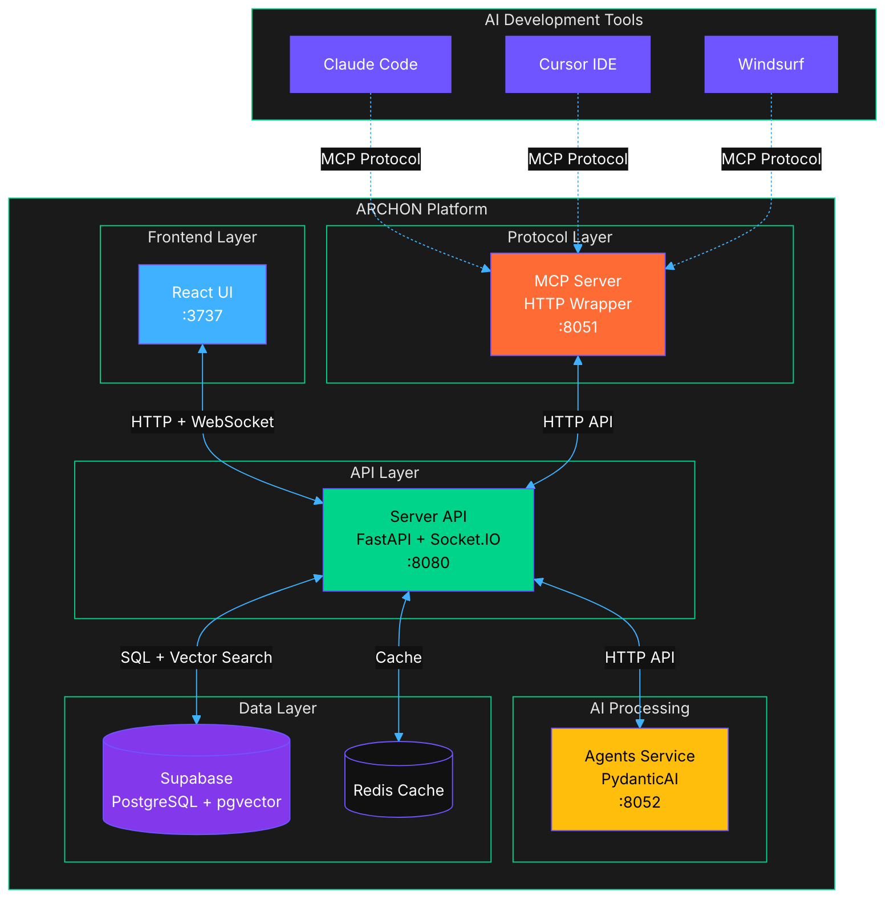
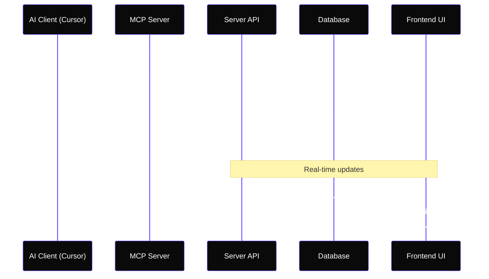
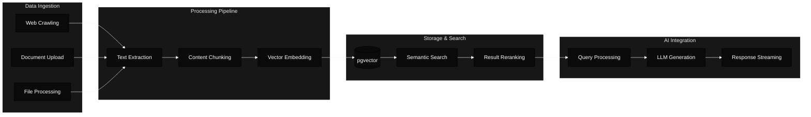

# ARCHON RELOADED
> **Next-Generation AI Development Platform with Model Context Protocol Integration**

[](https://github.com/JackSmack1971/ARCHONRELOADED)
[](LICENSE)
[](https://python.org)
[](https://typescriptlang.org)
[](https://reactjs.org)
[](https://fastapi.tiangolo.com)
[](https://docker.com)


---

## 🚀 Quick Start

```bash
# Clone the repository
git clone https://github.com/JackSmack1971/ARCHONRELOADED.git
cd ARCHONRELOADED

# Configure environment
cp .env.example .env
# Edit .env with your Supabase credentials

# Start all services
docker-compose up -d

# Access the platform
open http://localhost:3737
```

**🎯 Ready in 3 minutes** - ARCHON provides a complete AI development environment with knowledge management, real-time collaboration, and MCP integration for AI coding assistants.

---

## 📋 Overview

ARCHON RELOADED is a **microservices-based AI development platform** that revolutionizes how AI coding assistants access and utilize project knowledge. Through the Model Context Protocol (MCP), it provides seamless integration with popular AI IDEs like Claude Code, Cursor, and Windsurf.

### ⭐ Key Features

- **🔌 MCP Protocol Integration** - Direct connection to AI coding tools (Claude Code, Cursor, Windsurf)
- **🧠 Advanced RAG Pipeline** - Intelligent knowledge retrieval with vector search and reranking
- **📊 Real-time Collaboration** - Live updates via Socket.IO for team development
- **🎯 Project Management** - Hierarchical task organization with AI-assisted creation
- **🌐 Multi-LLM Support** - OpenAI, Google Gemini, and Ollama integration
- **📚 Knowledge Engine** - Document processing, web crawling, and semantic search
- **🔄 Background Processing** - Asynchronous operations with progress tracking

### 🏗️ Technology Stack

| Category | Technology | Purpose |
|----------|------------|---------|
| **Backend** | Python 3.12+ | Core business logic and services |
| **API Framework** | FastAPI + Socket.IO | REST API and real-time communication |
| **Frontend** | React 18.3 + TypeScript | Modern web interface |
| **Database** | Supabase (PostgreSQL + pgvector) | Data storage with vector embeddings |
| **Package Management** | uv (Python), npm (Node.js) | Dependency management |
| **Containerization** | Docker + docker-compose | Service orchestration |
| **AI Integration** | MCP Protocol | AI coding assistant connectivity |

---

## 🏛️ Architecture Overview

ARCHON uses a true microservices architecture with clear separation of concerns, allowing each service to scale independently while maintaining strong integration through well-defined APIs.

### System Architecture



### Service Communication Flow



### Microservices Breakdown

| Service | Location | Port | Purpose | Key Technologies |
|---------|----------|------|---------|------------------|
| **Frontend UI** | `archon-ui-main/` | 3737 | Web dashboard and interface | React 18, TypeScript, TailwindCSS |
| **Server API** | `python/src/server/` | 8080 | Core business logic and APIs | FastAPI, Socket.IO, Service Layer |
| **MCP Server** | `python/src/mcp/` | 8051 | Protocol adapter for AI clients | HTTP client, MCP tool definitions |
| **Agents Service** | `python/src/agents/` | 8052 | AI processing and generation | PydanticAI, streaming responses |

---

## 📊 Core Components

### RAG Pipeline Architecture



### Knowledge Management System

```mermaid
%%{init:{
  'theme':'base',
  'themeVariables': {
    'primaryColor':'#0a0a0a',
    'primaryTextColor':'#ffffff',
    'textColor':'#ffffff',
    'background':'#0a0a0a'
  }
}}%%
classDiagram
    class KnowledgeItem {
        +id: UUID
        +title: string
        +content: text
        +source_type: enum
        +embedding_vector: float[]
        +metadata: JSON
        +created_at: datetime
        +updated_at: datetime
        +get_summary()
        +update_embedding()
    }
    
    class Project {
        +id: UUID
        +name: string
        +description: text
        +status: enum
        +created_at: datetime
        +get_tasks()
        +add_knowledge_item()
    }
    
    class Task {
        +id: UUID
        +project_id: UUID
        +title: string
        +description: text
        +status: enum
        +priority: enum
        +assigned_to: string
        +complete_task()
        +update_status()
    }
    
    class Source {
        +id: UUID
        +url: string
        +type: enum
        +crawl_status: enum
        +last_crawled: datetime
        +start_crawl()
        +get_knowledge_items()
    }
    
    Project ||--o{ Task : contains
    Project ||--o{ KnowledgeItem : references
    Source ||--o{ KnowledgeItem : generates
```

---

## 🚀 Installation & Setup

### Prerequisites

| Requirement | Version | Purpose |
|-------------|---------|---------|
| **Docker** | 20.0+ | Container orchestration |
| **Docker Compose** | 2.0+ | Multi-service management |
| **Node.js** | 20.x | Frontend development (optional) |
| **Python** | 3.12+ | Backend development (optional) |

### Environment Configuration

Create a `.env` file in the root directory:

```bash
# Required - Database Configuration
SUPABASE_URL=https://your-project.supabase.co
SUPABASE_SERVICE_KEY=eyJ0eXAi...your_service_key

# Optional - AI Provider Configuration (can be set via UI)
OPENAI_API_KEY=sk-...your_openai_key
GOOGLE_API_KEY=...your_google_key

# Optional - Enhanced Logging
LOGFIRE_ENABLED=false              # Toggle enhanced logging
LOGFIRE_TOKEN=pylf_...             # Required when LOGFIRE_ENABLED=true

# Service Ports (optional customization)
ARCHON_UI_PORT=3737
ARCHON_SERVER_PORT=8080
ARCHON_MCP_PORT=8051
ARCHON_AGENTS_PORT=8052
ARCHON_DOCS_PORT=3838

# Hostname Configuration
HOST=localhost                     # Use custom domain if needed
```

### Quick Installation

```bash
# 1. Clone repository
git clone https://github.com/JackSmack1971/ARCHONRELOADED.git
cd ARCHONRELOADED

# 2. Setup environment
cp .env.example .env
# Edit .env with your credentials

# 3. Start all services
docker-compose up -d

# 4. Verify installation
curl http://localhost:8080/health
curl http://localhost:8051/sse
curl http://localhost:8052/health

# 5. Access the platform
open http://localhost:3737
```

### Database Setup

<details>
<summary><strong>🗄️ Supabase Configuration</strong></summary>

1. **Create Supabase Project**
   - Visit [supabase.com](https://supabase.com)
   - Create new project
   - Copy URL and service key from Settings → API

2. **Enable pgvector Extension**
   ```sql
   -- Run in Supabase SQL Editor
   CREATE EXTENSION IF NOT EXISTS vector;
   ```

3. **Tables Auto-Creation**
   - ARCHON automatically creates required tables on first run
   - No manual schema setup needed

</details>

---

## 💻 Usage Guide

### Basic Operations

#### 1. Knowledge Management

```bash
# Add web source for crawling
curl -X POST http://localhost:8080/api/sources \
  -H "Content-Type: application/json" \
  -d '{"url": "https://docs.example.com", "type": "documentation"}'

# Query knowledge base
curl -X POST http://localhost:8080/api/rag/query \
  -H "Content-Type: application/json" \
  -d '{"query": "How to deploy the application?", "match_count": 5}'

# Upload documents
curl -X POST http://localhost:8080/api/knowledge-items/upload \
  -F "file=@document.pdf" \
  -F "title=API Documentation"
```

#### 2. Project & Task Management

```bash
# Create project
curl -X POST http://localhost:8080/api/projects \
  -H "Content-Type: application/json" \
  -d '{"name": "Web Application", "description": "Main project"}'

# Add task to project
curl -X POST http://localhost:8080/api/projects/{project_id}/tasks \
  -H "Content-Type: application/json" \
  -d '{"title": "Implement authentication", "priority": "high"}'
```

#### 3. AI Agent Interaction

```bash
# Chat with document agent
curl -X POST http://localhost:8052/api/chat \
  -H "Content-Type: application/json" \
  -d '{"message": "Explain the deployment process", "agent_type": "document"}'

# Stream responses
curl -X POST http://localhost:8052/api/chat/stream \
  -H "Content-Type: application/json" \
  -d '{"message": "Generate project requirements", "agent_type": "project"}'
```

### Configuration Options

#### LLM Provider Setup

ARCHON supports multiple LLM providers:

| Provider | Configuration | Model Examples |
|----------|---------------|----------------|
| **OpenAI** | API key via Settings UI | gpt-4, gpt-3.5-turbo |
| **Google Gemini** | API key via Settings UI | gemini-pro, gemini-pro-vision |
| **Ollama** | Local installation + base URL | llama2, codellama, mistral |

#### RAG Strategy Configuration

```json
{
  "embedding_model": "text-embedding-ada-002",
  "chunk_size": 1000,
  "chunk_overlap": 200,
  "similarity_threshold": 0.7,
  "max_results": 10,
  "rerank_enabled": true
}
```

---

## 📁 Project Structure

```
ARCHONRELOADED/
├── 📄 README.md                    # This comprehensive guide
├── 📄 LICENSE                      # Archon Community License v1.2
├── 📄 CONTRIBUTING.md               # Contribution guidelines
├── 📄 AGENTS.md                     # AI collaboration guide
├── 🐳 docker-compose.yml           # Multi-service orchestration
├── 🐳 docker-compose.docs.yml      # Optional documentation service
├── ⚙️ .env.example                 # Environment template
│
├── 🐍 python/                      # Backend services (Python 3.12+)
│   ├── 📄 pyproject.toml           # Python dependencies (uv)
│   ├── 🔒 uv.lock                  # Dependency lock file
│   ├── 🐳 Dockerfile.server        # Server service container
│   ├── 🐳 Dockerfile.mcp           # MCP service container
│   ├── 🐳 Dockerfile.agents        # Agents service container
│   ├── 📁 src/                     # Source code
│   │   ├── 🔧 main.py              # Application entry point
│   │   ├── 🌐 server/              # FastAPI application
│   │   │   ├── 🔌 api_routes/      # REST API endpoints
│   │   │   │   ├── knowledge_api.py    # Knowledge management API
│   │   │   │   ├── projects_api.py     # Project & task management
│   │   │   │   ├── mcp_api.py          # MCP server control
│   │   │   │   ├── settings_api.py     # Configuration API
│   │   │   │   └── agent_chat_api.py   # AI agent interactions
│   │   │   ├── 🔧 services/        # Business logic layer
│   │   │   │   ├── rag/            # RAG services
│   │   │   │   │   ├── crawling_service.py     # Web crawling
│   │   │   │   │   ├── document_storage_service.py # Document processing
│   │   │   │   │   ├── search_service.py       # Vector search & reranking
│   │   │   │   │   └── source_management_service.py # Source metadata
│   │   │   │   ├── projects/       # Project management
│   │   │   │   │   ├── project_service.py      # Core operations
│   │   │   │   │   ├── task_service.py         # Task management
│   │   │   │   │   └── document_service.py     # Document operations
│   │   │   │   ├── storage/        # Storage operations
│   │   │   │   │   ├── document_storage_service.py # Parallel processing
│   │   │   │   │   └── code_storage_service.py     # Code extraction
│   │   │   │   ├── search/         # Search operations
│   │   │   │   │   └── vector_search_service.py    # Similarity search
│   │   │   │   ├── client_manager.py       # Database client management
│   │   │   │   ├── credential_service.py   # Credential management
│   │   │   │   ├── threading_service.py    # Thread pool & rate limiting
│   │   │   │   ├── mcp_service_client.py   # MCP HTTP client
│   │   │   │   ├── mcp_session_manager.py  # MCP session handling
│   │   │   │   └── prompt_service.py       # Prompt management
│   │   │   └── 📊 models/          # Data models
│   │   ├── 🔌 mcp/                 # MCP server implementation
│   │   │   ├── 📄 mcp_server.py    # MCP protocol server
│   │   │   └── 🛠️ modules/          # MCP tool definitions
│   │   ├── 🤖 agents/              # AI agent services
│   │   │   ├── 📄 main.py          # Agents service entry
│   │   │   ├── 📑 document_agent.py # Document Q&A agent
│   │   │   ├── 📋 project_agent.py  # Project management agent
│   │   │   └── 💬 chat_service.py   # Chat handling service
│   │   └── 🗄️ migration/           # Database migrations
│   └── 🧪 tests/                   # Comprehensive test suite
│       ├── 🔧 test_services/       # Service layer tests
│       ├── 🌐 test_api/            # API endpoint tests
│       ├── 🔌 test_mcp/            # MCP functionality tests
│       └── 🤖 test_agents/         # AI agent tests
│
├── 🎨 archon-ui-main/              # Frontend application (React 18.3)
│   ├── 📄 package.json             # Node.js dependencies
│   ├── 📄 package-lock.json        # Dependency lock file
│   ├── 🐳 Dockerfile               # Frontend container
│   ├── ⚙️ vite.config.ts           # Vite configuration
│   ├── ⚙️ tsconfig.json            # TypeScript configuration
│   ├── ⚙️ tailwind.config.js       # TailwindCSS configuration
│   ├── 📁 src/                     # Source code
│   │   ├── 📄 App.tsx              # Main application component
│   │   ├── 📄 main.tsx             # React entry point
│   │   ├── 🎨 components/          # React components
│   │   │   ├── ui/                 # Base UI components
│   │   │   ├── layouts/            # Layout components
│   │   │   ├── mcp/                # MCP-related components
│   │   │   ├── settings/           # Configuration components
│   │   │   ├── project-tasks/      # Project management UI
│   │   │   ├── knowledge-base/     # Knowledge management UI
│   │   │   └── animations/         # Animation components
│   │   ├── 📑 pages/               # Page components
│   │   │   ├── HomePage.tsx        # Knowledge base dashboard
│   │   │   ├── ProjectsPage.tsx    # Project management
│   │   │   ├── SettingsPage.tsx    # Configuration interface
│   │   │   ├── McpPage.tsx         # MCP server control
│   │   │   └── AgentChatPage.tsx   # AI agent interface
│   │   ├── 🔧 services/            # API service layer
│   │   │   ├── api.ts              # HTTP client configuration
│   │   │   ├── knowledgeService.ts # Knowledge API calls
│   │   │   ├── projectService.ts   # Project API calls
│   │   │   ├── mcpService.ts       # MCP API calls
│   │   │   ├── settingsService.ts  # Settings API calls
│   │   │   └── socketService.ts    # Socket.IO client
│   │   ├── 🎣 hooks/               # Custom React hooks
│   │   │   ├── useSocket.ts        # Socket.IO hook
│   │   │   └── useApi.ts           # API integration hook
│   │   ├── 🗂️ contexts/            # React contexts
│   │   │   ├── SocketContext.tsx   # Socket.IO context
│   │   │   ├── SettingsContext.tsx # Configuration context
│   │   │   └── ProjectContext.tsx  # Project state context
│   │   ├── 📚 lib/                 # Utility libraries
│   │   │   ├── utils.ts            # Helper functions
│   │   │   └── constants.ts        # Application constants
│   │   └── 🎨 styles/              # CSS styles
│   └── 🧪 test/                    # Frontend test suite
│       ├── ⚙️ setup.ts             # Test configuration
│       ├── 🎨 components/          # Component tests (68 files)
│       ├── 🔧 services/            # Service tests (12 files)
│       ├── 📑 pages/               # Page tests (5 files)
│       ├── 🎣 hooks/               # Hook tests (2 files)
│       ├── 🗂️ contexts/            # Context tests (3 files)
│       ├── 🔗 integration/         # Integration tests (8 files)
│       ├── 🎭 e2e/                 # End-to-end tests (5 files)
│       └── ⚡ performance/         # Performance tests (3 files)
│
└── 📖 docs/                        # Documentation site (Docusaurus)
    ├── 📄 package.json             # Documentation dependencies
    ├── 🐳 Dockerfile               # Documentation container
    ├── ⚙️ docusaurus.config.js     # Docusaurus configuration
    ├── 📁 docs/                    # Documentation content
    │   ├── getting-started.mdx     # Quick start guide
    │   ├── architecture.mdx        # System architecture
    │   ├── server-overview.mdx     # Server documentation
    │   ├── mcp-overview.mdx        # MCP integration guide
    │   ├── ui.mdx                  # Frontend documentation
    │   ├── configuration.mdx       # Configuration guide
    │   ├── api-reference.mdx       # API documentation
    │   ├── testing.mdx             # Testing guide
    │   └── deployment.mdx          # Deployment guide
    └── 📁 src/                     # Documentation source
        ├── 📁 components/          # Custom documentation components
        ├── 📁 css/                 # Documentation styles
        └── 📁 pages/               # Custom documentation pages
```

### Key File Responsibilities

| File/Directory | Purpose | Key Features |
|----------------|---------|--------------|
| `python/src/server/services/` | **Business Logic** | Service layer with dependency injection, async operations |
| `python/src/mcp/modules/` | **MCP Tools** | AI client integration, HTTP-based communication |
| `python/src/agents/` | **AI Processing** | PydanticAI agents, streaming responses |
| `archon-ui-main/src/components/` | **UI Components** | Reusable React components, feature-organized |
| `archon-ui-main/src/services/` | **API Layer** | HTTP client, Socket.IO integration |
| `docs/docs/` | **Documentation** | Comprehensive guides, API reference |

---

## 🛠️ Development Guide

### Development Environment Setup

#### Backend Development (Python)

```bash
# Navigate to Python directory
cd python

# Install uv package manager
pip install uv

# Install dependencies
uv sync --all-extras

# Activate virtual environment
source .venv/bin/activate  # Unix
# or
.venv\Scripts\activate     # Windows

# Run development server with hot reload
uv run uvicorn src.main:socket_app --host 0.0.0.0 --port 8080 --reload
```

#### Frontend Development (React)

```bash
# Navigate to frontend directory
cd archon-ui-main

# Install dependencies
npm install

# Start development server with hot reload
npm run dev

# Build for production
npm run build

# Run tests
npm test
```

#### MCP Development

```bash
# Test MCP server independently
cd python
uv run python src/mcp_server.py

# Test MCP tools
echo '{"method": "tools/call", "params": {"name": "search_knowledge", "arguments": {"query": "test"}}}' | \
  uv run python -m src.mcp_server
```

### Testing Strategy

#### Backend Testing (Python)

```bash
# Run all tests
cd python && uv run pytest

# Run specific test categories
uv run pytest tests/test_services/     # Service layer tests
uv run pytest tests/test_api/          # API endpoint tests
uv run pytest tests/test_mcp/          # MCP functionality tests
uv run pytest tests/test_agents/       # AI agent tests

# Run with coverage
uv run pytest --cov=src --cov-report=html
```

#### Frontend Testing (Vitest)

```bash
# Run all tests
cd archon-ui-main && npm test

# Run with coverage
npm run test:coverage

# Run specific test suites
npm test components/        # Component tests
npm test services/          # Service tests
npm test integration/       # Integration tests
npm test e2e/              # End-to-end tests
```

#### Integration Testing

```bash
# Start all services
docker-compose up -d

# Health checks
curl http://localhost:8080/health      # Server API
curl http://localhost:8051/sse         # MCP Server
curl http://localhost:8052/health      # Agents Service
curl http://localhost:3737             # Frontend UI

# Test MCP integration
curl -X POST http://localhost:8051/tools/call \
  -H "Content-Type: application/json" \
  -d '{"name": "search_knowledge", "arguments": {"query": "deployment"}}'
```

### Code Style & Standards

#### Python Code Standards

```python
# Service Pattern Example
class KnowledgeService:
    def __init__(self, supabase_client=None):
        self.supabase_client = supabase_client or get_supabase_client()
    
    async def search_knowledge(self, query: str, limit: int = 10) -> List[Dict]:
        """Search knowledge base using vector similarity."""
        try:
            # Async operations with proper error handling
            embedding = await self.get_embedding(query)
            results = await self.vector_search(embedding, limit)
            return {"success": True, "data": results}
        except Exception as e:
            logger.error(f"Knowledge search failed: {e}")
            return {"success": False, "error": str(e)}
```

#### TypeScript Code Standards

```typescript
// Service Pattern Example
export class KnowledgeService {
  private apiClient: ApiClient;
  
  constructor(apiClient: ApiClient) {
    this.apiClient = apiClient;
  }
  
  async searchKnowledge(query: string, limit: number = 10): Promise<ApiResponse<KnowledgeItem[]>> {
    try {
      const response = await this.apiClient.post('/api/knowledge/search', {
        query,
        limit
      });
      return response.data;
    } catch (error) {
      console.error('Knowledge search failed:', error);
      throw new ApiError('Failed to search knowledge base', error);
    }
  }
}
```

### Build & Deployment

#### Local Development Build

```bash
# Build all services
docker-compose build

# Build specific service
docker-compose build archon-server

# Start with rebuild
docker-compose up --build -d
```

#### Production Build

```bash
# Production environment file
cp .env.example .env.production

# Build optimized containers
docker-compose -f docker-compose.yml -f docker-compose.prod.yml build

# Deploy to production
docker-compose -f docker-compose.yml -f docker-compose.prod.yml up -d
```

---

## 🔧 API Reference

### REST API Endpoints

#### Knowledge Management API

| Method | Endpoint | Description | Request Body | Response |
|--------|----------|-------------|--------------|----------|
| `GET` | `/api/knowledge-items` | List all knowledge items | - | `{ items: KnowledgeItem[] }` |
| `POST` | `/api/knowledge-items` | Create knowledge item | `{ title, content, type }` | `{ item: KnowledgeItem }` |
| `PUT` | `/api/knowledge-items/{id}` | Update knowledge item | `{ title?, content?, type? }` | `{ item: KnowledgeItem }` |
| `DELETE` | `/api/knowledge-items/{id}` | Delete knowledge item | - | `{ success: boolean }` |
| `POST` | `/api/knowledge-items/upload` | Upload document | FormData | `{ item: KnowledgeItem }` |

#### Project Management API

| Method | Endpoint | Description | Request Body | Response |
|--------|----------|-------------|--------------|----------|
| `GET` | `/api/projects` | List all projects | - | `{ projects: Project[] }` |
| `POST` | `/api/projects` | Create project | `{ name, description }` | `{ project: Project }` |
| `GET` | `/api/projects/{id}` | Get project details | - | `{ project: Project }` |
| `POST` | `/api/projects/{id}/tasks` | Add task to project | `{ title, description, priority }` | `{ task: Task }` |
| `PUT` | `/api/projects/{id}/tasks/{task_id}` | Update task | `{ status?, priority? }` | `{ task: Task }` |

#### RAG Search API

| Method | Endpoint | Description | Request Body | Response |
|--------|----------|-------------|--------------|----------|
| `POST` | `/api/rag/query` | Search knowledge base | `{ query, match_count, filters? }` | `{ results: SearchResult[] }` |
| `POST` | `/api/rag/ask` | AI-powered Q&A | `{ question, context? }` | `{ answer: string, sources: Source[] }` |

#### Source Management API

| Method | Endpoint | Description | Request Body | Response |
|--------|----------|-------------|--------------|----------|
| `GET` | `/api/sources` | List all sources | - | `{ sources: Source[] }` |
| `POST` | `/api/sources` | Add source for crawling | `{ url, type }` | `{ source: Source }` |
| `POST` | `/api/sources/{id}/crawl` | Start crawling source | - | `{ crawl_id: string }` |
| `DELETE` | `/api/sources/{id}` | Delete source | - | `{ success: boolean }` |

### MCP Tools Reference

ARCHON provides comprehensive MCP tools for AI coding assistants:

#### Knowledge Tools

```typescript
// Search knowledge base
search_knowledge(query: string, limit?: number): SearchResult[]

// Get knowledge item details
get_knowledge_item(id: string): KnowledgeItem

// Add knowledge from text
add_knowledge(title: string, content: string, type?: string): KnowledgeItem
```

#### Project Tools

```typescript
// List projects
list_projects(): Project[]

// Create project
create_project(name: string, description: string): Project

// Add task to project
add_task(project_id: string, title: string, description?: string): Task

// Update task status
update_task_status(task_id: string, status: string): Task
```

#### Document Tools

```typescript
// Process uploaded document
process_document(file_path: string, title?: string): KnowledgeItem

// Extract code examples
extract_code(content: string, language?: string): CodeExample[]
```

### Socket.IO Events

ARCHON uses Socket.IO for real-time updates:

#### Client Events (Frontend → Server)

```typescript
// Join specific room for updates
socket.emit('join_room', { room: 'projects' });

// Request progress updates
socket.emit('subscribe_crawl_progress', { source_id: 'uuid' });
```

#### Server Events (Server → Frontend)

```typescript
// Knowledge base updates
socket.on('knowledge_item_created', (item: KnowledgeItem) => {});
socket.on('knowledge_item_updated', (item: KnowledgeItem) => {});
socket.on('knowledge_item_deleted', (id: string) => {});

// Project updates
socket.on('project_created', (project: Project) => {});
socket.on('task_updated', (task: Task) => {});

// Crawling progress
socket.on('crawl_progress', (progress: CrawlProgress) => {});
socket.on('crawl_completed', (result: CrawlResult) => {});

// AI agent responses
socket.on('agent_response_chunk', (chunk: string) => {});
socket.on('agent_response_complete', (response: AgentResponse) => {});
```

---

## 🚀 Deployment Guide

### Production Deployment

#### Environment Configuration

```bash
# Production environment variables
ENVIRONMENT=production
DEBUG=false

# Database - Use production Supabase instance
SUPABASE_URL=https://your-prod-project.supabase.co
SUPABASE_SERVICE_KEY=your_production_service_key

# AI Services - Production API keys
OPENAI_API_KEY=sk-prod-...
GOOGLE_API_KEY=your_prod_google_key

# Logging - Enable production logging
LOGFIRE_ENABLED=true
LOGFIRE_TOKEN=your_production_logfire_token

# Security
JWT_SECRET=your_secure_jwt_secret
CORS_ORIGINS=https://your-domain.com,https://app.your-domain.com

# Performance
WORKER_PROCESSES=4
MAX_CONNECTIONS=1000
CACHE_TTL=3600
```

#### Docker Production Setup

<details>
<summary><strong>🐳 Production Docker Configuration</strong></summary>

```yaml
# docker-compose.prod.yml
version: '3.8'

services:
  archon-server:
    build:
      context: ./python
      dockerfile: Dockerfile.server
      target: production
    environment:
      - ENVIRONMENT=production
      - WORKER_PROCESSES=4
    restart: unless-stopped
    healthcheck:
      test: ["CMD", "curl", "-f", "http://localhost:8080/health"]
      interval: 30s
      timeout: 10s
      retries: 3
      start_period: 40s

  archon-mcp:
    build:
      context: ./python
      dockerfile: Dockerfile.mcp
      target: production
    restart: unless-stopped
    healthcheck:
      test: ["CMD", "curl", "-f", "http://localhost:8051/sse"]
      interval: 30s
      timeout: 10s
      retries: 3

  archon-agents:
    build:
      context: ./python
      dockerfile: Dockerfile.agents
      target: production
    restart: unless-stopped
    healthcheck:
      test: ["CMD", "curl", "-f", "http://localhost:8052/health"]
      interval: 30s
      timeout: 10s
      retries: 3

  archon-frontend:
    build:
      context: ./archon-ui-main
      dockerfile: Dockerfile
      target: production
    restart: unless-stopped

  nginx:
    image: nginx:alpine
    ports:
      - "80:80"
      - "443:443"
    volumes:
      - ./nginx.conf:/etc/nginx/nginx.conf
      - ./ssl:/etc/nginx/ssl
    depends_on:
      - archon-server
      - archon-frontend
    restart: unless-stopped

networks:
  app-network:
    driver: bridge
```

</details>

#### Kubernetes Deployment

<details>
<summary><strong>☸️ Kubernetes Configuration</strong></summary>

```yaml
# k8s/namespace.yaml
apiVersion: v1
kind: Namespace
metadata:
  name: archon

---
# k8s/configmap.yaml
apiVersion: v1
kind: ConfigMap
metadata:
  name: archon-config
  namespace: archon
data:
  ENVIRONMENT: "production"
  ARCHON_SERVER_PORT: "8080"
  ARCHON_MCP_PORT: "8051"
  ARCHON_AGENTS_PORT: "8052"

---
# k8s/secret.yaml
apiVersion: v1
kind: Secret
metadata:
  name: archon-secrets
  namespace: archon
type: Opaque
stringData:
  SUPABASE_URL: "https://your-project.supabase.co"
  SUPABASE_SERVICE_KEY: "your_service_key"
  OPENAI_API_KEY: "sk-your_openai_key"

---
# k8s/deployment-server.yaml
apiVersion: apps/v1
kind: Deployment
metadata:
  name: archon-server
  namespace: archon
spec:
  replicas: 3
  selector:
    matchLabels:
      app: archon-server
  template:
    metadata:
      labels:
        app: archon-server
    spec:
      containers:
      - name: archon-server
        image: archon/server:latest
        ports:
        - containerPort: 8080
        envFrom:
        - configMapRef:
            name: archon-config
        - secretRef:
            name: archon-secrets
        livenessProbe:
          httpGet:
            path: /health
            port: 8080
          initialDelaySeconds: 30
          periodSeconds: 10
        readinessProbe:
          httpGet:
            path: /health
            port: 8080
          initialDelaySeconds: 5
          periodSeconds: 5

---
# k8s/service.yaml
apiVersion: v1
kind: Service
metadata:
  name: archon-server-service
  namespace: archon
spec:
  selector:
    app: archon-server
  ports:
  - protocol: TCP
    port: 8080
    targetPort: 8080
  type: ClusterIP

---
# k8s/ingress.yaml
apiVersion: networking.k8s.io/v1
kind: Ingress
metadata:
  name: archon-ingress
  namespace: archon
  annotations:
    nginx.ingress.kubernetes.io/ssl-redirect: "true"
    cert-manager.io/cluster-issuer: "letsencrypt-prod"
spec:
  tls:
  - hosts:
    - archon.yourdomain.com
    secretName: archon-tls
  rules:
  - host: archon.yourdomain.com
    http:
      paths:
      - path: /
        pathType: Prefix
        backend:
          service:
            name: archon-frontend-service
            port:
              number: 3737
      - path: /api
        pathType: Prefix
        backend:
          service:
            name: archon-server-service
            port:
              number: 8080
```

</details>

### Scaling & Performance

#### Horizontal Scaling

```bash
# Scale specific services
docker-compose up -d --scale archon-server=3
docker-compose up -d --scale archon-agents=2

# Kubernetes scaling
kubectl scale deployment archon-server --replicas=5 -n archon
kubectl scale deployment archon-agents --replicas=3 -n archon
```

#### Performance Monitoring

```bash
# Monitor resource usage
docker stats

# View logs
docker-compose logs -f archon-server
docker-compose logs -f --tail=100 archon-mcp

# Health checks
curl http://localhost:8080/health
curl http://localhost:8051/sse
curl http://localhost:8052/health
```

### Backup & Recovery

#### Database Backup

```bash
# Automated Supabase backup
# Use Supabase dashboard or CLI for automated backups

# Manual backup
pg_dump $SUPABASE_URL > archon_backup_$(date +%Y%m%d).sql

# Restore from backup
psql $SUPABASE_URL < archon_backup_20250817.sql
```

#### Configuration Backup

```bash
# Backup configuration
tar -czf archon_config_$(date +%Y%m%d).tar.gz .env docker-compose.yml

# Backup knowledge data
curl http://localhost:8080/api/knowledge-items > knowledge_backup.json
```

---

## 🤝 Contributing

We welcome contributions from the community! ARCHON RELOADED is designed to be hackable and extensible.

### Getting Started with Contributions

1. **Fork the Repository**
   ```bash
   git fork https://github.com/JackSmack1971/ARCHONRELOADED.git
   cd ARCHONRELOADED
   ```

2. **Set Up Development Environment**
   ```bash
   # Install dependencies
   cd python && uv sync --all-extras
   cd ../archon-ui-main && npm install
   
   # Start development services
   docker-compose up -d
   ```

3. **Create Feature Branch**
   ```bash
   git checkout -b feature/your-feature-name
   ```

### Contribution Areas

#### 🔧 Backend Services (Python)

**When to contribute:**
- Adding new API endpoints or business logic
- Implementing new MCP tools for AI clients
- Creating new service classes or utilities
- Improving RAG, embedding, or search functionality

**Key locations:**
- **Service Layer**: `python/src/server/services/` - Core business logic
- **API Endpoints**: `python/src/server/api_routes/` - REST API handlers
- **MCP Tools**: `python/src/mcp/modules/` - MCP protocol implementations
- **Agents**: `python/src/agents/` - PydanticAI agent implementations

#### 🎨 Frontend (React/TypeScript)

**When to contribute:**
- Adding new UI components or pages
- Implementing real-time features with Socket.IO
- Creating new service integrations
- Improving user experience and accessibility

**Key locations:**
- **Components**: `archon-ui-main/src/components/` - Reusable UI components
- **Pages**: `archon-ui-main/src/pages/` - Main application routes
- **Services**: `archon-ui-main/src/services/` - API communication layer
- **Contexts**: `archon-ui-main/src/contexts/` - React state management

#### 🐳 Infrastructure (Docker/DevOps)

**When to contribute:**
- Optimizing container builds or sizes
- Improving service orchestration
- Adding new environment configurations
- Enhancing health checks and monitoring

### Development Patterns

#### Backend Service Pattern

```python
class YourNewService:
    def __init__(self, supabase_client=None):
        self.supabase_client = supabase_client or get_supabase_client()
        self.logger = logging.getLogger(__name__)

    async def your_operation(self, param: str) -> Tuple[bool, Dict[str, Any]]:
        """
        Perform your business operation.
        
        Args:
            param: Description of parameter
            
        Returns:
            Tuple of (success: bool, result: dict)
        """
        try:
            # Async business logic here
            result = await self.supabase_client.table("your_table").insert(data).execute()
            return True, {"data": result.data}
        except Exception as e:
            self.logger.error(f"Operation failed: {e}")
            return False, {"error": str(e)}
```

#### MCP Tool Pattern

```python
@mcp.tool()
async def your_new_tool(ctx: Context, param: str) -> str:
    """
    Description of your MCP tool for AI clients.

    Args:
        param: Description of parameter

    Returns:
        JSON string with results
    """
    async with httpx.AsyncClient() as client:
        response = await client.post(f"{API_URL}/api/your-endpoint",
                                   json={"param": param})
        return json.dumps(response.json())
```

#### Frontend Service Pattern

```typescript
export class YourNewService {
  private apiClient: ApiClient;
  
  constructor(apiClient: ApiClient) {
    this.apiClient = apiClient;
  }
  
  async yourOperation(param: string): Promise<ApiResponse<YourResult>> {
    try {
      const response = await this.apiClient.post('/api/your-endpoint', {
        param
      });
      return response.data;
    } catch (error) {
      console.error('Operation failed:', error);
      throw new ApiError('Failed to perform operation', error);
    }
  }
}
```

### Testing Requirements

**Before submitting, ensure:**
- [ ] All existing tests pass
- [ ] New tests added for new functionality
- [ ] Manual testing of affected user flows
- [ ] Docker builds succeed for all services

**Test commands:**

```bash
# Backend tests
cd python && uv run pytest

# Frontend tests
cd archon-ui-main && npm test

# Integration test
docker-compose up --build -d
# Test via UI at http://localhost:3737
```

### Pull Request Process

1. **Submit Pull Request**
   - Clear description of changes
   - Reference any related issues
   - Include screenshots for UI changes

2. **Code Review**
   - Automated tests will run
   - Maintainers will review code and architecture
   - Address feedback and iterate as needed

3. **Merge**
   - Squash and merge preferred
   - Update documentation if needed

---

## 🔗 Additional Resources

### Documentation Links

- **📖 [Complete Documentation](http://localhost:3838)** - Comprehensive guides and tutorials
- **🏗️ [Architecture Guide](docs/docs/architecture.mdx)** - System design and patterns
- **🔧 [API Reference](docs/docs/api-reference.mdx)** - Complete API documentation
- **🧪 [Testing Guide](docs/docs/testing.mdx)** - Development and testing procedures
- **🚀 [Deployment Guide](docs/docs/deployment.mdx)** - Production deployment instructions

### External Resources

- **[Model Context Protocol](https://github.com/modelcontextprotocol/python-sdk)** - Official MCP SDK documentation
- **[FastAPI Documentation](https://fastapi.tiangolo.com/)** - FastAPI framework reference
- **[React Documentation](https://react.dev/)** - React framework reference
- **[Supabase Documentation](https://supabase.com/docs)** - Database and backend services
- **[PydanticAI Documentation](https://ai.pydantic.dev/)** - AI agent framework

### Community & Support

- **🐛 [GitHub Issues](https://github.com/JackSmack1971/ARCHONRELOADED/issues)** - Bug reports and feature requests
- **💬 [GitHub Discussions](https://github.com/JackSmack1971/ARCHONRELOADED/discussions)** - Community discussions
- **📊 [Logfire Dashboard](https://logfire.pydantic.dev/)** - Enhanced logging and monitoring (when enabled)

---

## 🔍 Troubleshooting

### Common Issues & Solutions

<details>
<summary><strong>🐳 Container Issues</strong></summary>

**Problem**: Services fail to start or connect

**Solutions:**
```bash
# Check Docker status
docker --version
docker compose version

# Rebuild containers
docker-compose down
docker-compose up --build -d

# Check container logs
docker-compose logs archon-server
docker-compose logs archon-mcp
docker-compose logs archon-agents

# Verify network connectivity
docker network ls
docker network inspect archonreloaded_app-network
```

</details>

<details>
<summary><strong>🔌 MCP Connection Issues</strong></summary>

**Problem**: AI clients can't connect to MCP server

**Solutions:**
```bash
# Verify MCP server is running
curl http://localhost:8051/sse

# Test MCP tools
echo '{"method": "tools/list"}' | curl -X POST http://localhost:8051/tools/list

# Check MCP logs
docker-compose logs archon-mcp

# Verify environment variables
docker-compose exec archon-mcp env | grep -E "(SUPABASE|API)"
```

</details>

<details>
<summary><strong>🔍 Empty Search Results</strong></summary>

**Problem**: Knowledge search returns no results

**Solutions:**
```bash
# Check available sources
curl http://localhost:8080/api/sources

# Verify embeddings are generated
curl http://localhost:8080/api/knowledge-items | jq '.[].embedding_vector'

# Test basic RAG query
curl -X POST http://localhost:8080/api/rag/query \
  -H "Content-Type: application/json" \
  -d '{"query": "test", "match_count": 1}'

# Check crawling status
curl http://localhost:8080/api/sources | jq '.[].crawl_status'
```

</details>

<details>
<summary><strong>🚨 Performance Issues</strong></summary>

**Problem**: Slow response times or high resource usage

**Solutions:**
```bash
# Monitor resource usage
docker stats

# Check database performance
# Run in Supabase SQL Editor:
# SELECT * FROM pg_stat_activity WHERE state = 'active';

# Optimize vector search
# Adjust similarity_threshold in RAG settings
# Reduce match_count for faster queries

# Scale services horizontally
docker-compose up -d --scale archon-server=2
docker-compose up -d --scale archon-agents=2
```

</details>

### Health Check Commands

```bash
# Comprehensive health check
./scripts/health-check.sh

# Or manually:
echo "=== Service Health Check ==="
curl -s http://localhost:8080/health && echo " ✅ Server API"
curl -s http://localhost:8051/sse >/dev/null && echo " ✅ MCP Server"
curl -s http://localhost:8052/health && echo " ✅ Agents Service"
curl -s http://localhost:3737 >/dev/null && echo " ✅ Frontend UI"

echo "=== Database Connectivity ==="
docker-compose exec archon-server python -c "
from src.database.supabase_client import get_supabase_client
client = get_supabase_client()
result = client.table('knowledge_items').select('id').limit(1).execute()
print('✅ Database connection successful')
"
```

---

## 📊 FAQ

<details>
<summary><strong>What makes ARCHON different from other AI development tools?</strong></summary>

ARCHON is specifically designed as a **knowledge engine** for AI coding assistants. Unlike general-purpose tools, it integrates directly with AI IDEs through the Model Context Protocol (MCP), providing real-time access to project knowledge, documentation, and task management. This creates a seamless workflow where your AI assistant can access all project context without manual copying and pasting.

</details>

<details>
<summary><strong>Which AI coding assistants work with ARCHON?</strong></summary>

ARCHON currently supports:
- **Claude Code** - Direct MCP integration
- **Cursor IDE** - Via MCP protocol
- **Windsurf** - Via MCP protocol
- **Any MCP-compatible AI tool** - Through standardized protocol

Future support planned for GitHub Copilot Workspace and other emerging AI development tools.

</details>

<details>
<summary><strong>Can I use ARCHON without AI coding assistants?</strong></summary>

Absolutely! ARCHON provides a complete web interface for:
- Knowledge base management and search
- Project and task organization
- Document processing and analysis
- AI-powered Q&A with your documents
- Real-time collaboration features

The MCP integration is optional and enhances the experience when using AI coding tools.

</details>

<details>
<summary><strong>What types of documents can ARCHON process?</strong></summary>

ARCHON supports:
- **Text formats**: Markdown, TXT, CSV, JSON
- **Document formats**: PDF, DOCX, RTF
- **Code formats**: All programming languages
- **Web content**: URLs, documentation sites, wikis
- **Structured data**: API documentation, schemas

All content is processed into searchable knowledge with semantic embeddings.

</details>

<details>
<summary><strong>How does the RAG (Retrieval-Augmented Generation) work?</strong></summary>

ARCHON's RAG pipeline:
1. **Ingestion**: Documents are chunked and embedded using OpenAI's models
2. **Storage**: Vectors stored in Supabase with pgvector for fast similarity search
3. **Retrieval**: User queries are embedded and matched against stored vectors
4. **Reranking**: Results are reranked for relevance and recency
5. **Generation**: Context is provided to LLMs for accurate, grounded responses

This ensures AI responses are based on your actual project knowledge.

</details>

<details>
<summary><strong>Can I run ARCHON offline or air-gapped?</strong></summary>

Partially. You can run ARCHON locally, but some features require internet access:
- **Fully offline**: Basic knowledge management, local document processing
- **Internet required**: OpenAI embeddings, web crawling, some AI features
- **Alternative**: Use Ollama for local LLM processing, though embeddings still need external API

For air-gapped deployments, consider using local embedding models (future feature).

</details>

<details>
<summary><strong>How secure is my data in ARCHON?</strong></summary>

ARCHON prioritizes data security:
- **Local deployment**: All data stays on your infrastructure
- **Encrypted storage**: Supabase provides encryption at rest and in transit
- **API key security**: Credentials stored encrypted in database
- **No data sharing**: No analytics or telemetry sent to external services
- **Open source**: Full transparency of data handling

Your knowledge base and projects remain completely private.

</details>

<details>
<summary><strong>What are the system requirements?</strong></summary>

**Minimum requirements:**
- 4GB RAM, 2 CPU cores
- 10GB storage space
- Docker & Docker Compose
- Internet connection for AI services

**Recommended:**
- 8GB+ RAM, 4+ CPU cores
- SSD storage for better performance
- Dedicated GPU for future local AI features

**Cloud deployment:**
- Scales from single VPS to enterprise Kubernetes clusters
- Supports horizontal scaling of all services

</details>

---

## 📄 License

**Archon Community License (ACL) v1.2** - see [LICENSE](LICENSE) file for complete terms.

### TL;DR License Summary

✅ **You Can:**
- Run ARCHON anywhere, for anything, completely free
- Study, modify, and improve the code
- Share your changes and forks publicly
- Use for personal and commercial projects

❌ **You Cannot (without permission):**
- Sell ARCHON as a paid download or service
- Offer hosted ARCHON instances to others
- Bundle ARCHON into paid products

💡 **Consulting/support is welcome** - Get paid to install, customize, or teach ARCHON, just don't run it as a service for others.

**Full license text:** [View LICENSE file](LICENSE)

---

## 🙏 Acknowledgments

ARCHON RELOADED builds upon the excellent work of many open-source projects and communities:

- **[Model Context Protocol](https://github.com/modelcontextprotocol)** - Standardized AI tool integration
- **[FastAPI](https://fastapi.tiangolo.com/)** - Modern Python web framework
- **[React](https://react.dev/)** - Component-based UI framework
- **[Supabase](https://supabase.com/)** - Open-source backend platform
- **[PydanticAI](https://ai.pydantic.dev/)** - Type-safe AI agent framework
- **[pgvector](https://github.com/pgvector/pgvector)** - Vector similarity search for PostgreSQL

Special thanks to the AI development community and early adopters who provided feedback and contributions.

---

## 📈 Changelog

### Version 2.0.0 (Current)
- **🔄 Complete microservices rewrite** - Independent, scalable services
- **🔌 MCP Protocol integration** - Direct AI coding assistant connectivity
- **🧠 Advanced RAG pipeline** - Improved search and retrieval
- **⚡ Real-time collaboration** - Socket.IO-based live updates
- **🎯 Enhanced project management** - Hierarchical task organization
- **🌐 Multi-LLM support** - OpenAI, Google Gemini, Ollama
- **🐳 Docker optimization** - Faster builds, smaller containers
- **📊 Comprehensive testing** - 100+ test files across services

### Version 1.x (Legacy)
- Initial monolithic architecture
- Basic knowledge management
- Single LLM provider support
- Limited real-time features

---

<div align="center">

## 🚀 Ready to Transform Your AI Development Workflow?

**[Get Started Now](http://localhost:3737)** • **[View Documentation](http://localhost:3838)** • **[Contribute](CONTRIBUTING.md)**

---

*Built with ❤️ by the ARCHON community*  
*Empowering AI-assisted development, one knowledge base at a time*

**⭐ Star this repo** if ARCHON helps supercharge your AI development experience!

---

*Generated on Sunday, August 17, 2025 • README v2.0.0*

</div>
