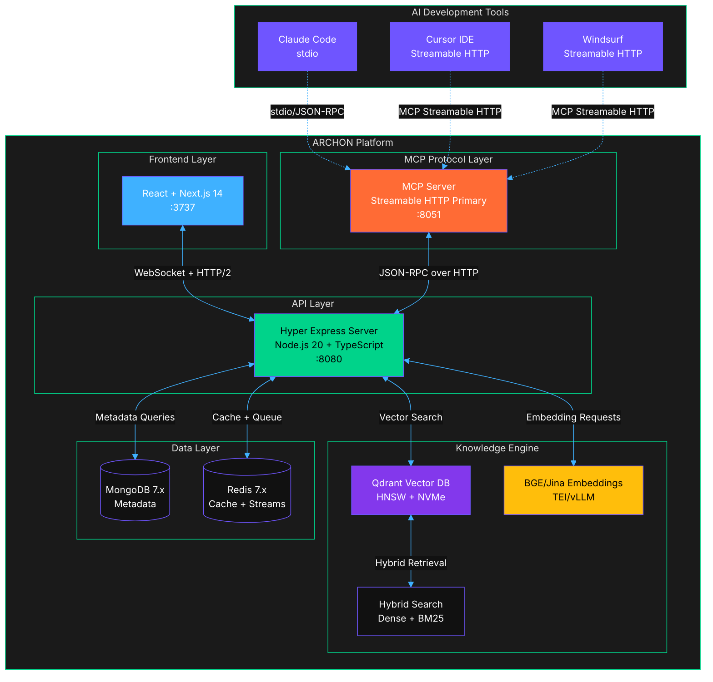
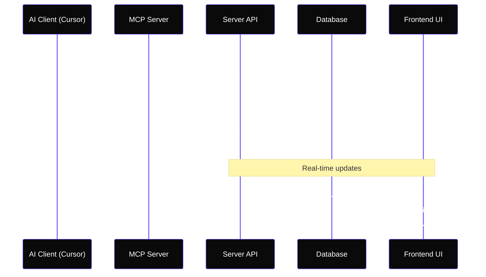
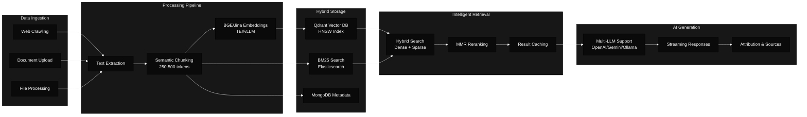

# ARCHON RELOADED
> **Next-Generation AI Development Platform with Model Context Protocol Integration**

[](https://github.com/JackSmack1971/ARCHONRELOADED)
[](LICENSE)
[](https://python.org)
[](https://typescriptlang.org)
[](https://reactjs.org)
[](https://fastapi.tiangolo.com)
[](https://docker.com)


---

## 🚀 Quick Start

```bash
# Clone the repository
git clone https://github.com/JackSmack1971/ARCHONRELOADED.git
cd ARCHONRELOADED

# Configure environment
cp .env.example .env
# Edit .env with your Supabase credentials

# Start all services
docker-compose up -d

# Access the platform
open http://localhost:3737
```

**🎯 Ready in 3 minutes** - ARCHON provides a complete AI development environment with knowledge management, real-time collaboration, and MCP integration for AI coding assistants.

---

## 📋 Overview

ARCHON RELOADED is a **microservices-based AI development platform** that revolutionizes how AI coding assistants access and utilize project knowledge. Through the Model Context Protocol (MCP), it provides seamless integration with popular AI IDEs like Claude Code, Cursor, and Windsurf.

### ⭐ Key Features

- **🔌 MCP Protocol Integration** - Direct connection to AI coding tools (Claude Code, Cursor, Windsurf)
- **🧠 Advanced RAG Pipeline** - Intelligent knowledge retrieval with vector search and reranking
- **📊 Real-time Collaboration** - Live updates via Socket.IO for team development
- **🎯 Project Management** - Hierarchical task organization with AI-assisted creation
- **🌐 Multi-LLM Support** - OpenAI, Google Gemini, and Ollama integration
- **📚 Knowledge Engine** - Document processing, web crawling, and semantic search
- **🔄 Background Processing** - Asynchronous operations with progress tracking

### 🏗️ Technology Stack

| Category | Technology | Purpose |
|----------|------------|---------|
| **Backend** | Node.js 20+ + TypeScript 5.x | High-performance runtime with strong typing |
| **API Framework** | Hyper Express + uWebSockets.js | Zero-copy HTTP/WebSocket server with streaming |
| **Frontend** | React 18.3 + Next.js 14 | Modern web interface with App Router |
| **Vector Database** | Qdrant (primary), Milvus (optional) | HNSW-based vector search with NVMe backing |
| **Metadata Store** | MongoDB 7.x | Document storage with retryable writes |
| **Cache & Queue** | Redis 7.x | Sessions, hot caches, and streaming queues |
| **Embeddings** | BGE-Large v1.5, Jina v2 (TEI/vLLM) | Self-hosted embeddings with fallbacks |
| **Orchestration** | Kubernetes + Docker | Cloud-native deployment with HPA/PDB |
| **AI Integration** | MCP Streamable HTTP (primary) | High-throughput bidirectional streaming |

---

## 🏛️ Architecture Overview

ARCHON uses a **cloud-native microservices architecture** optimized for high-performance real-time applications, built on Node.js with Hyper Express for superior concurrency and streaming capabilities.

### System Architecture



### Service Communication Flow



### Microservices Breakdown

| Service | Location | Port | Purpose | Key Technologies |
|---------|----------|------|---------|------------------|
| **Frontend UI** | `archon-ui-main/` | 3737 | Web dashboard and interface | React 18, Next.js 14, TypeScript |
| **MCP Server** | `nodejs/src/mcp/` | 8051 | High-performance MCP protocol adapter | Hyper Express, JSON-RPC 2.0, Streamable HTTP |
| **Knowledge Engine** | `nodejs/src/engine/` | 8080 | Vector search and RAG pipeline | Qdrant, BGE/Jina embeddings, hybrid search |
| **Embedding Service** | `nodejs/src/embeddings/` | 8082 | Self-hosted embedding generation | TEI/vLLM, BGE-Large v1.5, Jina v2 |

### Transport Protocol Priorities

| Protocol | Status | Use Case | Performance |
|----------|--------|----------|-------------|
| **MCP Streamable HTTP** | **Primary** | Cursor, Windsurf, future tools | High-throughput bidirectional streaming |
| **stdio/JSON-RPC** | **Secondary** | Claude Code, local development | Low-latency local communication |
| **Server-Sent Events** | **Legacy** | Compatibility fallback | Phased deprecation planned |

### Performance SLOs

| Metric | Target | Critical Threshold |
|--------|--------|--------------------|
| **Dense Vector Search** | p95 < 200ms | p99 < 400ms |
| **Hybrid Search** | p95 < 350ms | p99 < 500ms |
| **Concurrent Sessions** | ≥250 per shard | <0.5% error rate |
| **Document Ingestion** | TTFI < 30s (50-page PDF) | < 60s worst case |
| **System Availability** | ≥99.9% uptime | Error budget policy |

---

## 📊 Core Components

### Advanced RAG Pipeline Architecture



### Embedding Strategy

| Model | Dimensions | Use Case | Serving |
|-------|------------|----------|---------|
| **BGE-Large v1.5** | 1024 | Default, high-quality retrieval | TEI/vLLM self-hosted |
| **Jina v2 Base** | 768 | Cross-lingual, faster inference | TEI/vLLM self-hosted |
| **OpenAI TE3** | 1536 | Fallback, managed service | OpenAI API |
| **Cohere Embed** | 1024 | Alternative fallback | Cohere API |

### Vector Database Configuration

**Qdrant HNSW Parameters:**
- **M**: 32 (connections per node)
- **ef_construction**: 256 (build-time search depth)
- **ef_search**: 100-200 (query-time search depth)
- **Quantization**: Optional scalar/product quantization
- **Storage**: NVMe-backed for sub-200ms p95 latency

### Knowledge Management System

```mermaid
%%{init:{
  'theme':'base',
  'themeVariables': {
    'primaryColor':'#0a0a0a',
    'primaryTextColor':'#ffffff',
    'textColor':'#ffffff',
    'background':'#0a0a0a'
  }
}}%%
classDiagram
    class KnowledgeItem {
        +id: UUID
        +title: string
        +content: text
        +source_type: enum
        +embedding_vector: float[]
        +metadata: JSON
        +created_at: datetime
        +updated_at: datetime
        +get_summary()
        +update_embedding()
    }
    
    class Project {
        +id: UUID
        +name: string
        +description: text
        +status: enum
        +created_at: datetime
        +get_tasks()
        +add_knowledge_item()
    }
    
    class Task {
        +id: UUID
        +project_id: UUID
        +title: string
        +description: text
        +status: enum
        +priority: enum
        +assigned_to: string
        +complete_task()
        +update_status()
    }
    
    class Source {
        +id: UUID
        +url: string
        +type: enum
        +crawl_status: enum
        +last_crawled: datetime
        +start_crawl()
        +get_knowledge_items()
    }
    
    Project ||--o{ Task : contains
    Project ||--o{ KnowledgeItem : references
    Source ||--o{ KnowledgeItem : generates
```

---

## 🚀 Installation & Setup

### Prerequisites

| Requirement | Version | Purpose |
|-------------|---------|---------|
| **Docker** | 20.0+ | Container orchestration |
| **Kubernetes** | 1.25+ | Cloud-native deployment (recommended) |
| **Node.js** | 20.x LTS | Backend runtime |
| **npm/yarn** | Latest | Package management |

### Cloud-Native Deployment (Recommended)

**Kubernetes Configuration:**

```yaml
# Key cluster requirements
apiVersion: v1
kind: Namespace
metadata:
  name: archon

---
# HPA Configuration
apiVersion: autoscaling/v2
kind: HorizontalPodAutoscaler
metadata:
  name: archon-mcp-hpa
spec:
  scaleTargetRef:
    apiVersion: apps/v1
    kind: Deployment
    name: archon-mcp
  minReplicas: 3
  maxReplicas: 50
  metrics:
  - type: Resource
    resource:
      name: cpu
      target:
        type: Utilization
        averageUtilization: 60
  - type: Pods
    pods:
      metric:
        name: request_latency_p95
      target:
        type: AverageValue
        averageValue: "200m"  # 200ms
```

**Node Pool Configuration:**

```yaml
# General application node pool
nodeSelector:
  archon.io/node-type: "general"
tolerations:
- key: archon.io/general
  operator: Equal
  value: "true"
  effect: NoSchedule

# Storage-optimized pool for Qdrant
nodeSelector:
  archon.io/node-type: "storage"
  storage-type: "nvme"
tolerations:
- key: archon.io/storage
  operator: Equal  
  value: "true"
  effect: NoSchedule
```

### Environment Configuration

```bash
# Core Services
NODE_ENV=production
LOG_LEVEL=info

# Vector Database
QDRANT_URL=http://qdrant-cluster:6333
QDRANT_API_KEY=your_qdrant_key
QDRANT_COLLECTION=archon_vectors

# Embeddings Service  
EMBEDDING_MODEL=bge-large-en-v1.5  # or jina-embeddings-v2-base
TEI_ENDPOINT=http://tei-service:8080
VLLM_ENDPOINT=http://vllm-service:8000

# Metadata & Cache
MONGODB_URI=mongodb://mongo-cluster:27017/archon
REDIS_URL=redis://redis-cluster:6379

# AI Provider Fallbacks (optional)
OPENAI_API_KEY=sk-...your_key
COHERE_API_KEY=co-...your_key

# Performance Tuning
MAX_CONCURRENT_SESSIONS=250
VECTOR_CACHE_TTL=3600
EMBEDDING_BATCH_SIZE=1024
```

### Quick Installation

```bash
# 1. Clone repository
git clone https://github.com/JackSmack1971/ARCHONRELOADED.git
cd ARCHONRELOADED

# 2. Setup environment
cp .env.example .env
# Edit .env with your credentials

# 3. Start all services
docker-compose up -d

# 4. Verify installation
curl http://localhost:8080/health
curl http://localhost:8051/sse
curl http://localhost:8052/health

# 5. Access the platform
open http://localhost:3737
```

### Database Setup

<details>
<summary><strong>🗄️ Supabase Configuration</strong></summary>

1. **Create Supabase Project**
   - Visit [supabase.com](https://supabase.com)
   - Create new project
   - Copy URL and service key from Settings → API

2. **Enable pgvector Extension**
   ```sql
   -- Run in Supabase SQL Editor
   CREATE EXTENSION IF NOT EXISTS vector;
   ```

3. **Tables Auto-Creation**
   - ARCHON automatically creates required tables on first run
   - No manual schema setup needed

</details>

---

## 💻 Usage Guide

### Basic Operations

#### 1. Knowledge Management

```bash
# Add web source for crawling
curl -X POST http://localhost:8080/api/sources \
  -H "Content-Type: application/json" \
  -d '{"url": "https://docs.example.com", "type": "documentation"}'

# Query knowledge base
curl -X POST http://localhost:8080/api/rag/query \
  -H "Content-Type: application/json" \
  -d '{"query": "How to deploy the application?", "match_count": 5}'

# Upload documents
curl -X POST http://localhost:8080/api/knowledge-items/upload \
  -F "file=@document.pdf" \
  -F "title=API Documentation"
```

#### 2. Project & Task Management

```bash
# Create project
curl -X POST http://localhost:8080/api/projects \
  -H "Content-Type: application/json" \
  -d '{"name": "Web Application", "description": "Main project"}'

# Add task to project
curl -X POST http://localhost:8080/api/projects/{project_id}/tasks \
  -H "Content-Type: application/json" \
  -d '{"title": "Implement authentication", "priority": "high"}'
```

#### 3. AI Agent Interaction

```bash
# Chat with document agent
curl -X POST http://localhost:8052/api/chat \
  -H "Content-Type: application/json" \
  -d '{"message": "Explain the deployment process", "agent_type": "document"}'

# Stream responses
curl -X POST http://localhost:8052/api/chat/stream \
  -H "Content-Type: application/json" \
  -d '{"message": "Generate project requirements", "agent_type": "project"}'
```

### Configuration Options

#### LLM Provider Setup

ARCHON supports multiple LLM providers:

| Provider | Configuration | Model Examples |
|----------|---------------|----------------|
| **OpenAI** | API key via Settings UI | gpt-4, gpt-3.5-turbo |
| **Google Gemini** | API key via Settings UI | gemini-pro, gemini-pro-vision |
| **Ollama** | Local installation + base URL | llama2, codellama, mistral |

#### RAG Strategy Configuration

```json
{
  "embedding_model": "text-embedding-ada-002",
  "chunk_size": 1000,
  "chunk_overlap": 200,
  "similarity_threshold": 0.7,
  "max_results": 10,
  "rerank_enabled": true
}
```

---

## 📁 Project Structure

```
ARCHONRELOADED/
├── 📄 README.md                    # This comprehensive guide
├── 📄 LICENSE                      # Archon Community License v1.2
├── 📄 CONTRIBUTING.md               # Contribution guidelines
├── 📄 AGENTS.md                     # AI collaboration guide
├── 🐳 docker-compose.yml           # Multi-service orchestration
├── ☸️ k8s/                          # Kubernetes manifests
│   ├── namespace.yaml               # Cluster namespace
│   ├── configmap.yaml               # Configuration
│   ├── secret.yaml                  # Encrypted secrets
│   ├── deployments/                 # Service deployments
│   ├── services/                    # Service definitions
│   ├── ingress.yaml                 # Traffic routing
│   └── hpa.yaml                     # Horizontal Pod Autoscaler
├── ⚙️ .env.example                 # Environment template
│
├── 🟢 nodejs/                      # Backend services (Node.js 20 + TypeScript)
│   ├── 📄 package.json             # Node.js dependencies
│   ├── 📄 tsconfig.json            # TypeScript configuration
│   ├── 🐳 Dockerfile.mcp           # MCP service container
│   ├── 🐳 Dockerfile.engine        # Knowledge engine container
│   ├── 🐳 Dockerfile.embeddings    # Embedding service container
│   ├── 📁 src/                     # Source code
│   │   ├── 🔧 index.ts             # Application entry point
│   │   ├── 🌐 mcp/                 # MCP Server (Hyper Express)
│   │   │   ├── 📄 server.ts        # MCP protocol server
│   │   │   ├── 🔌 transports/      # Transport implementations
│   │   │   │   ├── streamable-http.ts   # Primary transport
│   │   │   │   ├── stdio.ts             # Local/Claude Code
│   │   │   │   └── sse.ts               # Legacy compatibility
│   │   │   ├── 🛠️ tools/           # MCP tool definitions
│   │   │   │   ├── search-knowledge.ts  # Vector search tool
│   │   │   │   ├── manage-projects.ts   # Project management
│   │   │   │   ├── process-documents.ts # Document processing
│   │   │   │   └── real-time-collab.ts  # Collaboration tools
│   │   │   └── 📊 middleware/      # Request processing
│   │   ├── 🧠 engine/              # Knowledge Engine
│   │   │   ├── 📄 server.ts        # Hyper Express server
│   │   │   ├── 🔧 services/        # Business logic layer
│   │   │   │   ├── rag/            # RAG pipeline services
│   │   │   │   │   ├── hybrid-search.ts    # Dense + BM25 search
│   │   │   │   │   ├── document-processor.ts # Document ingestion
│   │   │   │   │   ├── embedding-service.ts  # BGE/Jina embedding client
│   │   │   │   │   ├── vector-store.ts      # Qdrant operations
│   │   │   │   │   └── reranker.ts          # MMR and ML reranking
│   │   │   │   ├── projects/       # Project management
│   │   │   │   │   ├── project-service.ts   # Core operations
│   │   │   │   │   ├── task-service.ts      # Task management
│   │   │   │   │   └── collaboration.ts     # Real-time sync
│   │   │   │   ├── cache/          # Caching strategies
│   │   │   │   │   ├── redis-cache.ts       # Hot query caches
│   │   │   │   │   ├── vector-cache.ts      # Vector result caching
│   │   │   │   │   └── session-cache.ts     # User session state
│   │   │   │   └── monitoring/     # Observability
│   │   │   │       ├── metrics.ts          # Prometheus metrics
│   │   │   │       ├── tracing.ts          # OpenTelemetry
│   │   │   │       └── health-checks.ts    # Service health
│   │   │   └── 📊 models/          # TypeScript data models
│   │   ├── 🤖 embeddings/          # Self-hosted Embedding Service
│   │   │   ├── 📄 server.ts        # TEI/vLLM client wrapper
│   │   │   ├── 🔧 providers/       # Embedding model providers
│   │   │   │   ├── bge-large.ts    # BGE-Large v1.5 (primary)
│   │   │   │   ├── jina-v2.ts      # Jina embeddings v2
│   │   │   │   ├── openai.ts       # OpenAI fallback
│   │   │   │   └── cohere.ts       # Cohere fallback
│   │   │   ├── 📊 batching/        # Efficient batch processing
│   │   │   │   ├── adaptive-batcher.ts # Dynamic batch sizing
│   │   │   │   ├── queue-manager.ts    # Request queuing
│   │   │   │   └── backpressure.ts     # Load balancing
│   │   │   └── 🔄 scaling/         # Auto-scaling logic
│   │   │       ├── tei-scaler.ts   # TEI instance management
│   │   │       └── vllm-scaler.ts  # vLLM cluster scaling
│   │   └── 🧪 tests/               # Comprehensive test suite
│   │       ├── 🔧 unit/            # Unit tests (Jest/Vitest)
│   │       ├── 🌐 integration/     # Integration tests
│   │       ├── 🔌 mcp/             # MCP protocol tests
│   │       ├── ⚡ performance/     # Load and performance tests
│   │       └── 🎭 e2e/             # End-to-end tests
│
├── 🎨 archon-ui-main/              # Frontend application (React 18.3)
│   ├── 📄 package.json             # Node.js dependencies
│   ├── 📄 next.config.js           # Next.js 14 configuration
│   ├── 🐳 Dockerfile               # Frontend container
│   ├── ⚙️ tailwind.config.js       # TailwindCSS configuration
│   ├── 📁 src/                     # Source code
│   │   ├── 📄 app/                 # Next.js 14 App Router
│   │   │   ├── layout.tsx          # Root layout
│   │   │   ├── page.tsx            # Home page
│   │   │   ├── knowledge/          # Knowledge management pages
│   │   │   ├── projects/           # Project management pages
│   │   │   ├── mcp/                # MCP server control pages
│   │   │   └── settings/           # Configuration pages
│   │   ├── 🎨 components/          # React components
│   │   │   ├── ui/                 # shadcn/ui components
│   │   │   ├── knowledge/          # Knowledge management UI
│   │   │   ├── projects/           # Project management UI
│   │   │   ├── mcp/                # MCP server monitoring
│   │   │   ├── real-time/          # WebSocket components
│   │   │   └── virtualized/        # Performance-optimized lists
│   │   ├── 🔧 services/            # API service layer
│   │   │   ├── api-client.ts       # HTTP client (Hyper Express)
│   │   │   ├── websocket-client.ts # Real-time communication
│   │   │   ├── knowledge-service.ts # Knowledge API calls
│   │   │   ├── project-service.ts  # Project API calls
│   │   │   └── mcp-service.ts      # MCP monitoring calls
│   │   ├── 🎣 hooks/               # Custom React hooks
│   │   │   ├── use-websocket.ts    # WebSocket hook
│   │   │   ├── use-virtual-list.ts # Virtualization hook
│   │   │   └── use-real-time.ts    # Real-time sync hook
│   │   ├── 🗂️ store/               # State management (Zustand)
│   │   │   ├── knowledge-store.ts  # Knowledge state
│   │   │   ├── project-store.ts    # Project state
│   │   │   └── session-store.ts    # Session state
│   │   └── 🎨 styles/              # Global styles
│   └── 🧪 __tests__/               # Frontend test suite
│       ├── 🎨 components/          # Component tests (React Testing Library)
│       ├── 🔧 services/            # Service tests
│       ├── 🎣 hooks/               # Hook tests
│       ├── 🎭 e2e/                 # End-to-end tests (Playwright)
│       └── ⚡ performance/         # Performance tests
│
├── 🤖 embeddings/                  # Self-hosted Embedding Infrastructure
│   ├── 📁 tei/                     # Text Embeddings Inference
│   │   ├── 🐳 Dockerfile           # TEI container
│   │   ├── ⚙️ config.toml          # TEI configuration
│   │   └── 📊 models/              # Model configurations
│   ├── 📁 vllm/                    # vLLM serving
│   │   ├── 🐳 Dockerfile           # vLLM container
│   │   ├── ⚙️ config.yaml          # vLLM configuration
│   │   └── 📊 models/              # Model serving configs
│   └── 📁 monitoring/              # Embedding service monitoring
│       ├── prometheus.yml          # Metrics collection
│       └── grafana-dashboard.json  # Performance dashboards
│
├── 🗄️ infrastructure/              # Infrastructure as Code
│   ├── 📁 helm/                    # Helm charts
│   │   ├── archon-mcp/             # MCP server chart
│   │   ├── archon-engine/          # Knowledge engine chart
│   │   ├── archon-embeddings/      # Embeddings service chart
│   │   ├── qdrant/                 # Qdrant vector database
│   │   ├── mongodb/                # MongoDB metadata store
│   │   └── redis/                  # Redis cache and streams
│   ├── 📁 terraform/               # Infrastructure provisioning
│   │   ├── aws/                    # AWS EKS cluster
│   │   ├── gcp/                    # GKE cluster
│   │   └── azure/                  # AKS cluster
│   └── 📁 monitoring/              # Observability stack
│       ├── prometheus/             # Metrics collection
│       ├── grafana/                # Dashboards and visualization
│       ├── loki/                   # Log aggregation
│       └── tempo/                  # Distributed tracing
│
└── 📖 docs/                        # Documentation site (Docusaurus)
    ├── 📄 package.json             # Documentation dependencies
    ├── 🐳 Dockerfile               # Documentation container
    ├── ⚙️ docusaurus.config.js     # Docusaurus configuration
    ├── 📁 docs/                    # Documentation content
    │   ├── getting-started.mdx     # Quick start guide
    │   ├── architecture.mdx        # System architecture
    │   ├── mcp-integration.mdx     # MCP protocol guide
    │   ├── embedding-setup.mdx     # Self-hosted embeddings
    │   ├── kubernetes-deploy.mdx   # K8s deployment guide
    │   ├── performance-tuning.mdx  # Performance optimization
    │   ├── observability.mdx       # Monitoring and alerting
    │   └── api-reference.mdx       # Complete API documentation
    └── 📁 src/                     # Documentation source
        ├── 📁 components/          # Custom documentation components
        ├── 📁 css/                 # Documentation styles
        └── 📁 pages/               # Custom documentation pages
```

### Key File Responsibilities

| File/Directory | Purpose | Key Features |
|----------------|---------|--------------|
| `python/src/server/services/` | **Business Logic** | Service layer with dependency injection, async operations |
| `python/src/mcp/modules/` | **MCP Tools** | AI client integration, HTTP-based communication |
| `python/src/agents/` | **AI Processing** | PydanticAI agents, streaming responses |
| `archon-ui-main/src/components/` | **UI Components** | Reusable React components, feature-organized |
| `archon-ui-main/src/services/` | **API Layer** | HTTP client, Socket.IO integration |
| `docs/docs/` | **Documentation** | Comprehensive guides, API reference |

---

## 🛠️ Development Guide

### Development Environment Setup

#### Backend Development (Node.js + TypeScript)

```bash
# Navigate to Node.js directory
cd nodejs

# Install dependencies
npm install
# or
yarn install

# Development with hot reload
npm run dev:mcp          # MCP server with Hyper Express
npm run dev:engine       # Knowledge engine
npm run dev:embeddings   # Embedding service

# Type checking
npm run type-check

# Linting and formatting
npm run lint
npm run format
```

#### Cloud-Native Development

```bash
# Local Kubernetes development with Skaffold
skaffold dev --port-forward

# Helm chart development
helm template archon-mcp k8s/helm/archon-mcp --values k8s/helm/archon-mcp/values-dev.yaml

# Deploy to local cluster
kubectl apply -k k8s/overlays/development
```

#### Observability Development

```bash
# Start observability stack
docker-compose -f docker-compose.observability.yml up -d

# Generate sample telemetry
npm run load-test

# View metrics: http://localhost:3000 (Grafana)
# View traces: http://localhost:16686 (Jaeger)
# View logs: http://localhost:3100 (Loki)
```

### Testing Strategy

#### Backend Testing (Node.js + TypeScript)

```bash
# Unit tests with Jest
npm test
npm run test:watch
npm run test:coverage

# Integration tests with test containers
npm run test:integration

# MCP protocol tests
npm run test:mcp

# Performance tests
npm run test:performance
npm run load-test

# E2E tests with Playwright
npm run test:e2e
```

#### Observability Testing

```bash
# Golden Signals validation
npm run test:golden-signals

# SLO compliance testing
npm run test:slos

# Chaos engineering tests
npm run test:chaos
```

### Performance Profiling

#### Node.js Performance Analysis

```bash
# CPU profiling
node --prof nodejs/src/index.ts
node --prof-process isolate-*.log > profile.txt

# Memory profiling
node --inspect nodejs/src/index.ts
# Connect to chrome://inspect

# Event loop monitoring
npm run monitor:event-loop

# Custom metrics collection
npm run collect:metrics
```

#### Vector Database Optimization

```bash
# Qdrant performance tuning
npm run tune:qdrant-hnsw
npm run benchmark:vector-search

# Embedding batch optimization
npm run optimize:embedding-batches

# Cache warming
npm run warm:caches
```

### Code Quality Standards

#### TypeScript Best Practices

```typescript
// Hyper Express Route Pattern
import { HyperRequest, HyperResponse } from 'hyper-express';
import { z } from 'zod';

const SearchRequestSchema = z.object({
  query: z.string().min(1).max(1000),
  limit: z.number().int().min(1).max(100).default(10),
  filters: z.record(z.any()).optional()
});

export async function searchKnowledge(req: HyperRequest, res: HyperResponse) {
  try {
    const params = SearchRequestSchema.parse(req.body);
    
    // Golden signals tracking
    const startTime = Date.now();
    req.metrics?.requestsTotal.inc({ method: 'search_knowledge' });
    
    const results = await vectorSearch.hybridSearch(params);
    
    // Latency tracking (p95 target: <350ms)
    const latency = Date.now() - startTime;
    req.metrics?.requestDuration.observe({ method: 'search_knowledge' }, latency);
    
    res.json({ results, latency_ms: latency });
  } catch (error) {
    req.metrics?.errorsTotal.inc({ method: 'search_knowledge' });
    res.status(500).json({ error: error.message });
  }
}
```

#### OpenTelemetry Integration

```typescript
// Instrumentation setup
import { NodeSDK } from '@opentelemetry/sdk-node';
import { getNodeAutoInstrumentations } from '@opentelemetry/auto-instrumentations-node';
import { PerformanceObserver } from 'perf_hooks';

const sdk = new NodeSDK({
  instrumentations: [getNodeAutoInstrumentations()],
  serviceName: 'archon-mcp',
  serviceVersion: '2.0.0'
});

// Event loop monitoring
const obs = new PerformanceObserver((list) => {
  const entries = list.getEntries();
  entries.forEach((entry) => {
    // Track event loop lag for performance monitoring
    metrics.eventLoopLag.set(entry.duration);
  });
});
obs.observe({ entryTypes: ['measure'] });

sdk.start();
```

### Build & Deployment

#### Local Development Build

```bash
# Build all services
docker-compose build

# Build specific service
docker-compose build archon-server

# Start with rebuild
docker-compose up --build -d
```

#### Production Build

```bash
# Production environment file
cp .env.example .env.production

# Build optimized containers
docker-compose -f docker-compose.yml -f docker-compose.prod.yml build

# Deploy to production
docker-compose -f docker-compose.yml -f docker-compose.prod.yml up -d
```

---

## 🔧 API Reference

### High-Performance REST API (Hyper Express)

ARCHON's API is built on Hyper Express for maximum throughput and minimal latency, optimized for real-time AI interactions.

#### Knowledge Management API

| Method | Endpoint | Description | SLO Target | Response |
|--------|----------|-------------|------------|----------|
| `POST` | `/api/search` | Hybrid vector + BM25 search | p95 < 350ms | `{ results: SearchResult[], latency_ms: number }` |
| `POST` | `/api/search/dense` | Pure vector similarity search | p95 < 200ms | `{ results: VectorResult[], latency_ms: number }` |
| `POST` | `/api/knowledge/ingest` | Process document for indexing | TTFI < 30s | `{ job_id: string, status: 'processing' }` |
| `GET` | `/api/knowledge/status/:job_id` | Check ingestion status | p95 < 50ms | `{ status: string, progress: number }` |
| `POST` | `/api/embeddings/batch` | Generate embeddings batch | p95 < 500ms | `{ embeddings: number[][], model: string }` |

#### MCP Protocol Endpoints

| Method | Endpoint | Description | Transport | Performance |
|--------|----------|-------------|-----------|-------------|
| `POST` | `/mcp/stream` | **Primary** - Streamable HTTP | Bidirectional streaming | ≥250 concurrent sessions |
| `POST` | `/mcp/rpc` | JSON-RPC 2.0 over HTTP | Request/response | p95 < 100ms |
| `GET` | `/mcp/sse` | **Legacy** - Server-Sent Events | Unidirectional streaming | Deprecation planned |

#### Real-time Collaboration API

| Method | Endpoint | Description | Protocol | Use Case |
|--------|----------|-------------|----------|----------|
| `WS` | `/ws/collaborate` | Live document sync | WebSocket | Real-time editing |
| `WS` | `/ws/sessions` | Agent session management | WebSocket | Multi-user coordination |
| `POST` | `/api/sync/conflict` | Conflict resolution | HTTP | OT/CRDT operations |

### MCP Tools Reference

ARCHON provides comprehensive MCP tools optimized for AI coding assistants:

#### Knowledge Tools

```typescript
// Hybrid search with performance tracking
search_knowledge(
  query: string,
  options?: {
    mode?: 'hybrid' | 'dense' | 'sparse',
    limit?: number,          // default: 10, max: 100
    threshold?: number,      // similarity threshold 0-1
    filters?: Record<string, any>
  }
): Promise<{
  results: SearchResult[],
  latency_ms: number,
  mode: string,
  total_found: number
}>

// Document ingestion with progress tracking
ingest_document(
  content: string | File,
  metadata: {
    title: string,
    source_type: 'upload' | 'crawl' | 'api',
    tags?: string[]
  }
): Promise<{
  job_id: string,
  estimated_completion: string,
  chunk_count: number
}>

// Real-time search suggestions
suggest_queries(
  partial_query: string,
  context?: string[]
): Promise<{
  suggestions: string[],
  confidence_scores: number[]
}>
```

#### Project & Collaboration Tools

```typescript
// Create collaborative workspace
create_workspace(
  name: string,
  config: {
    real_time_sync: boolean,
    max_participants: number,
    conflict_resolution: 'ot' | 'crdt' | 'manual'
  }
): Promise<{
  workspace_id: string,
  join_url: string,
  session_token: string
}>

// Live document synchronization
sync_document(
  document_id: string,
  operations: Operation[],
  session_id: string
): Promise<{
  applied_ops: Operation[],
  conflicts: Conflict[],
  document_version: number
}>
```

### Performance Monitoring Endpoints

#### Golden Signals API

```typescript
// SLO compliance monitoring
GET /api/metrics/slos
Response: {
  search_latency: {
    p95_ms: number,
    target_ms: 350,
    compliance_percentage: number
  },
  availability: {
    uptime_percentage: number,
    target_percentage: 99.9,
    error_budget_remaining: number
  },
  throughput: {
    concurrent_sessions: number,
    target_sessions: 250,
    utilization_percentage: number
  }
}

// Real-time performance metrics
GET /api/metrics/realtime
Response: {
  event_loop_lag_ms: number,
  memory_usage_mb: number,
  active_connections: number,
  queue_depth: number,
  cache_hit_ratio: number
}
```

### WebSocket Events (Real-time Communication)

ARCHON uses native WebSocket connections via Hyper Express for optimal real-time performance:

#### Client Events (Frontend → Server)

```typescript
// Join collaboration session
socket.emit('join_session', {
  session_id: string,
  user_id: string,
  capabilities: string[]
});

// Live document editing
socket.emit('document_operation', {
  document_id: string,
  operation: {
    type: 'insert' | 'delete' | 'retain',
    position: number,
    content?: string,
    length?: number
  },
  session_id: string
});

// Real-time search as you type
socket.emit('live_search', {
  query: string,
  context_id: string,
  debounce_ms: 300
});
```

#### Server Events (Server → Frontend)

```typescript
// Search results streaming
socket.on('search_results_chunk', (data: {
  query_id: string,
  results: SearchResult[],
  is_final: boolean,
  latency_ms: number
}) => {});

// Document synchronization
socket.on('document_synced', (data: {
  document_id: string,
  operations: Operation[],
  conflicts: Conflict[],
  author_id: string
}) => {});

// Performance alerts
socket.on('performance_alert', (data: {
  metric: string,
  current_value: number,
  threshold: number,
  severity: 'warning' | 'critical'
}) => {});

// Embedding service status
socket.on('embedding_service_status', (data: {
  service: 'tei' | 'vllm',
  status: 'healthy' | 'degraded' | 'down',
  queue_depth: number,
  response_time_ms: number
}) => {});
```

### Error Handling & Status Codes

#### HTTP Status Codes

| Code | Meaning | Usage |
|------|---------|-------|
| `200` | Success | Request completed successfully |
| `202` | Accepted | Async operation started (e.g., document ingestion) |
| `400` | Bad Request | Invalid parameters or malformed request |
| `429` | Rate Limited | Exceeded concurrent session limit (250/shard) |
| `503` | Service Unavailable | Embedding service overloaded |
| `504` | Gateway Timeout | Search exceeded SLO thresholds |

#### Error Response Format

```typescript
{
  error: {
    code: string,
    message: string,
    details?: any,
    trace_id?: string,
    timestamp: string,
    suggested_retry_after_ms?: number
  }
}
```

---

## 🚀 Cloud-Native Deployment Guide

### Kubernetes-Native Architecture (Recommended)

ARCHON is designed as a **cloud-native application** with Kubernetes as the primary deployment target, optimized for high availability, auto-scaling, and observability.

#### Cluster Requirements

```yaml
# Minimum cluster specifications
apiVersion: v1
kind: ConfigMap
metadata:
  name: cluster-requirements
data:
  kubernetes_version: ">=1.25"
  node_pools: |
    general:
      instance_type: "n1-standard-4"  # 4 vCPU, 15GB RAM
      min_nodes: 3
      max_nodes: 20
      disk_type: "pd-ssd"
      disk_size: "100GB"
    
    storage_optimized:  # For Qdrant
      instance_type: "n1-highmem-8"  # 8 vCPU, 52GB RAM
      min_nodes: 1
      max_nodes: 5
      disk_type: "local-nvme"
      disk_size: "375GB"
      
  networking:
    cni: "calico"  # or compatible
    service_mesh: "istio"  # optional
    ingress_controller: "nginx"
```

#### Resource Allocation Strategy

| Service | CPU Request | CPU Limit | Memory Request | Memory Limit | Storage |
|---------|-------------|-----------|----------------|--------------|---------|
| **MCP Server** | 300m | 1000m | 512Mi | 2Gi | 10Gi |
| **Knowledge Engine** | 500m | 2000m | 1Gi | 4Gi | 20Gi |
| **Qdrant Vector DB** | 2000m | 8000m | 8Gi | 32Gi | 100Gi NVMe |
| **TEI Embeddings** | 1000m | 4000m | 4Gi | 16Gi | 50Gi |
| **MongoDB** | 500m | 2000m | 2Gi | 8Gi | 100Gi |
| **Redis** | 200m | 1000m | 512Mi | 2Gi | 20Gi |

### Production Deployment Workflow

#### 1. Infrastructure Provisioning

<details>
<summary><strong>🏗️ Terraform Infrastructure Setup</strong></summary>

```hcl
# infrastructure/terraform/gke/main.tf
resource "google_container_cluster" "archon_cluster" {
  name     = "archon-production"
  location = var.region
  
  # Node pools defined separately
  remove_default_node_pool = true
  initial_node_count       = 1
  
  # Network configuration for high performance
  network_config {
    enable_private_nodes   = true
    enable_private_endpoint = false
    master_ipv4_cidr_block = "172.16.0.0/28"
  }
  
  # Observability
  monitoring_config {
    enable_components = ["SYSTEM_COMPONENTS", "WORKLOADS"]
  }
  
  logging_config {
    enable_components = ["SYSTEM_COMPONENTS", "WORKLOADS"]
  }
}

# General application node pool
resource "google_container_node_pool" "general_nodes" {
  cluster    = google_container_cluster.archon_cluster.name
  location   = google_container_cluster.archon_cluster.location
  name       = "general-pool"
  
  autoscaling {
    min_node_count = 3
    max_node_count = 20
  }
  
  node_config {
    machine_type = "n1-standard-4"
    disk_type    = "pd-ssd"
    disk_size_gb = 100
    
    labels = {
      "archon.io/node-type" = "general"
    }
    
    taint {
      key    = "archon.io/general"
      value  = "true"
      effect = "NO_SCHEDULE"
    }
  }
}

# Storage-optimized node pool for Qdrant
resource "google_container_node_pool" "storage_nodes" {
  cluster    = google_container_cluster.archon_cluster.name
  location   = google_container_cluster.archon_cluster.location
  name       = "storage-pool"
  
  autoscaling {
    min_node_count = 1
    max_node_count = 5
  }
  
  node_config {
    machine_type    = "n1-highmem-8"
    local_ssd_count = 1  # NVMe for vector operations
    
    labels = {
      "archon.io/node-type" = "storage"
      "storage-type"        = "nvme"
    }
    
    taint {
      key    = "archon.io/storage"
      value  = "true"
      effect = "NO_SCHEDULE"
    }
  }
}
```

</details>

#### 2. GitOps Deployment with ArgoCD

```yaml
# argocd/applications/archon-production.yaml
apiVersion: argoproj.io/v1alpha1
kind: Application
metadata:
  name: archon-production
  namespace: argocd
spec:
  project: default
  source:
    repoURL: https://github.com/JackSmack1971/ARCHONRELOADED
    targetRevision: main
    path: k8s/overlays/production
    
  destination:
    server: https://kubernetes.default.svc
    namespace: archon
    
  syncPolicy:
    automated:
      prune: true
      selfHeal: true
      allowEmpty: false
    syncOptions:
    - CreateNamespace=true
    - PrunePropagationPolicy=foreground
    
  # Health checks for custom resources
  ignoreDifferences:
  - group: apps
    kind: Deployment
    jsonPointers:
    - /spec/replicas  # Managed by HPA
```

#### 3. Horizontal Pod Autoscaler Configuration

```yaml
# k8s/base/hpa/mcp-server-hpa.yaml
apiVersion: autoscaling/v2
kind: HorizontalPodAutoscaler
metadata:
  name: archon-mcp-hpa
  namespace: archon
spec:
  scaleTargetRef:
    apiVersion: apps/v1
    kind: Deployment
    name: archon-mcp
  minReplicas: 3
  maxReplicas: 50
  
  # Multi-metric scaling
  metrics:
  - type: Resource
    resource:
      name: cpu
      target:
        type: Utilization
        averageUtilization: 60
        
  - type: Resource
    resource:
      name: memory
      target:
        type: Utilization
        averageUtilization: 70
        
  # Custom metric: request latency p95
  - type: Pods
    pods:
      metric:
        name: http_request_duration_p95
      target:
        type: AverageValue
        averageValue: "200m"  # 200ms target
        
  # Custom metric: concurrent sessions
  - type: Object
    object:
      metric:
        name: active_sessions_count
      target:
        type: Value
        value: "200"  # Scale when approaching 250 limit
      describedObject:
        apiVersion: v1
        kind: Service
        name: archon-mcp

  # Scaling behavior
  behavior:
    scaleUp:
      stabilizationWindowSeconds: 60
      policies:
      - type: Percent
        value: 100
        periodSeconds: 15
    scaleDown:
      stabilizationWindowSeconds: 300
      policies:
      - type: Percent
        value: 10
        periodSeconds: 60
```

#### 4. Pod Disruption Budget & Anti-Affinity

```yaml
# k8s/base/pdb/mcp-server-pdb.yaml
apiVersion: policy/v1
kind: PodDisruptionBudget
metadata:
  name: archon-mcp-pdb
  namespace: archon
spec:
  minAvailable: 2
  selector:
    matchLabels:
      app: archon-mcp

---
# Anti-affinity for cross-AZ distribution
apiVersion: apps/v1
kind: Deployment
metadata:
  name: archon-mcp
spec:
  template:
    spec:
      affinity:
        podAntiAffinity:
          requiredDuringSchedulingIgnoredDuringExecution:
          - labelSelector:
              matchExpressions:
              - key: app
                operator: In
                values:
                - archon-mcp
            topologyKey: topology.kubernetes.io/zone
            
        nodeAffinity:
          requiredDuringSchedulingIgnoredDuringExecution:
            nodeSelectorTerms:
            - matchExpressions:
              - key: archon.io/node-type
                operator: In
                values:
                - general
      
      tolerations:
      - key: archon.io/general
        operator: Equal
        value: "true"
        effect: NoSchedule
```

### Observability Stack (OpenTelemetry + Prometheus + Grafana)

#### OpenTelemetry Collector Configuration

```yaml
# k8s/base/observability/otel-collector.yaml
apiVersion: v1
kind: ConfigMap
metadata:
  name: otel-collector-config
  namespace: archon
data:
  config.yaml: |
    receivers:
      otlp:
        protocols:
          grpc:
            endpoint: 0.0.0.0:4317
          http:
            endpoint: 0.0.0.0:4318
            
      prometheus:
        config:
          scrape_configs:
          - job_name: 'archon-services'
            kubernetes_sd_configs:
            - role: pod
            relabel_configs:
            - source_labels: [__meta_kubernetes_pod_annotation_prometheus_io_scrape]
              action: keep
              regex: true
    
    processors:
      batch:
        timeout: 1s
        send_batch_size: 1024
        
      # Resource detection for K8s metadata
      k8sattributes:
        auth_type: "serviceAccount"
        passthrough: false
        extract:
          metadata:
          - k8s.pod.name
          - k8s.pod.uid
          - k8s.deployment.name
          - k8s.namespace.name
          - k8s.node.name
    
    exporters:
      # Prometheus for metrics
      prometheus:
        endpoint: "0.0.0.0:8889"
        
      # Tempo for traces
      otlp/tempo:
        endpoint: http://tempo:4317
        tls:
          insecure: true
          
      # Loki for logs  
      loki:
        endpoint: http://loki:3100/loki/api/v1/push
    
    service:
      pipelines:
        traces:
          receivers: [otlp]
          processors: [k8sattributes, batch]
          exporters: [otlp/tempo]
          
        metrics:
          receivers: [otlp, prometheus]
          processors: [k8sattributes, batch]
          exporters: [prometheus]
          
        logs:
          receivers: [otlp]
          processors: [k8sattributes, batch]
          exporters: [loki]
```

#### SLO Monitoring & Alerting

```yaml
# k8s/base/monitoring/slo-alerts.yaml
apiVersion: monitoring.coreos.com/v1
kind: PrometheusRule
metadata:
  name: archon-slo-alerts
  namespace: archon
spec:
  groups:
  - name: archon.slos
    rules:
    # Search latency SLO (p95 < 350ms)
    - alert: SearchLatencyHigh
      expr: |
        histogram_quantile(0.95, 
          rate(http_request_duration_seconds_bucket{
            job="archon-mcp",
            handler="/api/search"
          }[5m])
        ) > 0.35
      for: 2m
      labels:
        severity: warning
        slo: latency
      annotations:
        summary: "Search latency p95 above SLO threshold"
        description: "p95 latency is {{ $value }}s, exceeding 350ms SLO"
        
    # Dense search latency SLO (p95 < 200ms)  
    - alert: DenseSearchLatencyHigh
      expr: |
        histogram_quantile(0.95,
          rate(http_request_duration_seconds_bucket{
            job="archon-mcp",
            handler="/api/search/dense"
          }[5m])
        ) > 0.20
      for: 1m
      labels:
        severity: critical
        slo: latency
      annotations:
        summary: "Dense search latency p95 above SLO threshold"
        description: "Dense search p95 latency is {{ $value }}s, exceeding 200ms SLO"
        
    # Availability SLO (99.9% uptime)
    - alert: AvailabilityLow
      expr: |
        (
          sum(rate(http_requests_total{job="archon-mcp"}[5m])) -
          sum(rate(http_requests_total{job="archon-mcp",code=~"5.."}[5m]))
        ) / sum(rate(http_requests_total{job="archon-mcp"}[5m])) < 0.999
      for: 5m
      labels:
        severity: critical
        slo: availability
      annotations:
        summary: "Service availability below SLO"
        description: "Availability is {{ $value | humanizePercentage }}, below 99.9% SLO"
        
    # Concurrent sessions SLO (≥250 per shard)
    - alert: ConcurrentSessionsLow
      expr: |
        archon_active_sessions{job="archon-mcp"} < 250
      for: 10m
      labels:
        severity: warning
        slo: throughput
      annotations:
        summary: "Concurrent sessions below target"
        description: "Only {{ $value }} active sessions, target is ≥250 per shard"
```

### Production Readiness Checklist

#### Pre-Deployment Validation

```bash
# Infrastructure validation
terraform plan -var-file="production.tfvars"
kubectl cluster-info
kubectl get nodes -o wide

# Application validation  
helm template archon-mcp k8s/helm/archon-mcp \
  --values k8s/helm/archon-mcp/values-prod.yaml | kubectl apply --dry-run=client -f -

# Security validation
kubectl auth can-i create pods --as=system:serviceaccount:archon:archon-mcp
kubesec scan k8s/base/deployments/mcp-server.yaml

# Performance validation
kubectl run load-test --image=loadimpact/k6 --rm -it -- \
  run - <load-test-script.js
```

#### Deployment Execution

```bash
# 1. Deploy infrastructure
cd infrastructure/terraform/gke
terraform apply -var-file="production.tfvars"

# 2. Configure cluster access
gcloud container clusters get-credentials archon-production \
  --region=us-central1 --project=your-project

# 3. Install observability stack
kubectl apply -k k8s/observability/base

# 4. Deploy ARCHON application
kubectl apply -k k8s/overlays/production

# 5. Verify deployment
kubectl get pods -n archon
kubectl get hpa -n archon
kubectl get pdb -n archon

# 6. Run health checks
kubectl port-forward -n archon svc/archon-mcp 8051:8051 &
curl http://localhost:8051/health

# 7. Validate SLOs
kubectl port-forward -n monitoring svc/grafana 3000:3000 &
# Visit http://localhost:3000 and check SLO dashboard
```

#### Post-Deployment Monitoring

```bash
# Monitor golden signals
kubectl logs -n archon deployment/archon-mcp -f

# Check HPA scaling behavior
kubectl get hpa archon-mcp-hpa -w

# Validate observability data
kubectl port-forward -n monitoring svc/prometheus 9090:9090 &
# Query: rate(http_request_duration_seconds_sum[5m]) / rate(http_request_duration_seconds_count[5m])

# Test failover scenarios
kubectl delete pod -n archon -l app=archon-mcp --force
# Verify automatic recovery and SLO compliance
```

---

## 🤝 Contributing

We welcome contributions from the community! ARCHON RELOADED is designed to be hackable and extensible.

### Getting Started with Contributions

1. **Fork the Repository**
   ```bash
   git fork https://github.com/JackSmack1971/ARCHONRELOADED.git
   cd ARCHONRELOADED
   ```

2. **Set Up Development Environment**
   ```bash
   # Install dependencies
   cd python && uv sync --all-extras
   cd ../archon-ui-main && npm install
   
   # Start development services
   docker-compose up -d
   ```

3. **Create Feature Branch**
   ```bash
   git checkout -b feature/your-feature-name
   ```

### Contribution Areas

#### 🔧 Backend Services (Python)

**When to contribute:**
- Adding new API endpoints or business logic
- Implementing new MCP tools for AI clients
- Creating new service classes or utilities
- Improving RAG, embedding, or search functionality

**Key locations:**
- **Service Layer**: `python/src/server/services/` - Core business logic
- **API Endpoints**: `python/src/server/api_routes/` - REST API handlers
- **MCP Tools**: `python/src/mcp/modules/` - MCP protocol implementations
- **Agents**: `python/src/agents/` - PydanticAI agent implementations

#### 🎨 Frontend (React/TypeScript)

**When to contribute:**
- Adding new UI components or pages
- Implementing real-time features with Socket.IO
- Creating new service integrations
- Improving user experience and accessibility

**Key locations:**
- **Components**: `archon-ui-main/src/components/` - Reusable UI components
- **Pages**: `archon-ui-main/src/pages/` - Main application routes
- **Services**: `archon-ui-main/src/services/` - API communication layer
- **Contexts**: `archon-ui-main/src/contexts/` - React state management

#### 🐳 Infrastructure (Docker/DevOps)

**When to contribute:**
- Optimizing container builds or sizes
- Improving service orchestration
- Adding new environment configurations
- Enhancing health checks and monitoring

### Development Patterns

#### Backend Service Pattern

```python
class YourNewService:
    def __init__(self, supabase_client=None):
        self.supabase_client = supabase_client or get_supabase_client()
        self.logger = logging.getLogger(__name__)

    async def your_operation(self, param: str) -> Tuple[bool, Dict[str, Any]]:
        """
        Perform your business operation.
        
        Args:
            param: Description of parameter
            
        Returns:
            Tuple of (success: bool, result: dict)
        """
        try:
            # Async business logic here
            result = await self.supabase_client.table("your_table").insert(data).execute()
            return True, {"data": result.data}
        except Exception as e:
            self.logger.error(f"Operation failed: {e}")
            return False, {"error": str(e)}
```

#### MCP Tool Pattern

```python
@mcp.tool()
async def your_new_tool(ctx: Context, param: str) -> str:
    """
    Description of your MCP tool for AI clients.

    Args:
        param: Description of parameter

    Returns:
        JSON string with results
    """
    async with httpx.AsyncClient() as client:
        response = await client.post(f"{API_URL}/api/your-endpoint",
                                   json={"param": param})
        return json.dumps(response.json())
```

#### Frontend Service Pattern

```typescript
export class YourNewService {
  private apiClient: ApiClient;
  
  constructor(apiClient: ApiClient) {
    this.apiClient = apiClient;
  }
  
  async yourOperation(param: string): Promise<ApiResponse<YourResult>> {
    try {
      const response = await this.apiClient.post('/api/your-endpoint', {
        param
      });
      return response.data;
    } catch (error) {
      console.error('Operation failed:', error);
      throw new ApiError('Failed to perform operation', error);
    }
  }
}
```

### Testing Requirements

**Before submitting, ensure:**
- [ ] All existing tests pass
- [ ] New tests added for new functionality
- [ ] Manual testing of affected user flows
- [ ] Docker builds succeed for all services

**Test commands:**

```bash
# Backend tests
cd python && uv run pytest

# Frontend tests
cd archon-ui-main && npm test

# Integration test
docker-compose up --build -d
# Test via UI at http://localhost:3737
```

### Pull Request Process

1. **Submit Pull Request**
   - Clear description of changes
   - Reference any related issues
   - Include screenshots for UI changes

2. **Code Review**
   - Automated tests will run
   - Maintainers will review code and architecture
   - Address feedback and iterate as needed

3. **Merge**
   - Squash and merge preferred
   - Update documentation if needed

---

## 🔗 Additional Resources

### Documentation Links

- **📖 [Complete Documentation](http://localhost:3838)** - Comprehensive guides and tutorials
- **🏗️ [Architecture Guide](docs/docs/architecture.mdx)** - System design and patterns
- **🔧 [API Reference](docs/docs/api-reference.mdx)** - Complete API documentation
- **🧪 [Testing Guide](docs/docs/testing.mdx)** - Development and testing procedures
- **🚀 [Deployment Guide](docs/docs/deployment.mdx)** - Production deployment instructions

### External Resources

- **[Model Context Protocol](https://github.com/modelcontextprotocol/python-sdk)** - Official MCP SDK documentation
- **[FastAPI Documentation](https://fastapi.tiangolo.com/)** - FastAPI framework reference
- **[React Documentation](https://react.dev/)** - React framework reference
- **[Supabase Documentation](https://supabase.com/docs)** - Database and backend services
- **[PydanticAI Documentation](https://ai.pydantic.dev/)** - AI agent framework

### Community & Support

- **🐛 [GitHub Issues](https://github.com/JackSmack1971/ARCHONRELOADED/issues)** - Bug reports and feature requests
- **💬 [GitHub Discussions](https://github.com/JackSmack1971/ARCHONRELOADED/discussions)** - Community discussions
- **📊 [Logfire Dashboard](https://logfire.pydantic.dev/)** - Enhanced logging and monitoring (when enabled)

---

## 🔍 Troubleshooting

### Common Issues & Solutions

<details>
<summary><strong>🐳 Container Issues</strong></summary>

**Problem**: Services fail to start or connect

**Solutions:**
```bash
# Check Docker status
docker --version
docker compose version

# Rebuild containers
docker-compose down
docker-compose up --build -d

# Check container logs
docker-compose logs archon-server
docker-compose logs archon-mcp
docker-compose logs archon-agents

# Verify network connectivity
docker network ls
docker network inspect archonreloaded_app-network
```

</details>

<details>
<summary><strong>🔌 MCP Connection Issues</strong></summary>

**Problem**: AI clients can't connect to MCP server

**Solutions:**
```bash
# Verify MCP server is running
curl http://localhost:8051/sse

# Test MCP tools
echo '{"method": "tools/list"}' | curl -X POST http://localhost:8051/tools/list

# Check MCP logs
docker-compose logs archon-mcp

# Verify environment variables
docker-compose exec archon-mcp env | grep -E "(SUPABASE|API)"
```

</details>

<details>
<summary><strong>🔍 Empty Search Results</strong></summary>

**Problem**: Knowledge search returns no results

**Solutions:**
```bash
# Check available sources
curl http://localhost:8080/api/sources

# Verify embeddings are generated
curl http://localhost:8080/api/knowledge-items | jq '.[].embedding_vector'

# Test basic RAG query
curl -X POST http://localhost:8080/api/rag/query \
  -H "Content-Type: application/json" \
  -d '{"query": "test", "match_count": 1}'

# Check crawling status
curl http://localhost:8080/api/sources | jq '.[].crawl_status'
```

</details>

<details>
<summary><strong>🚨 Performance Issues</strong></summary>

**Problem**: Slow response times or high resource usage

**Solutions:**
```bash
# Monitor resource usage
docker stats

# Check database performance
# Run in Supabase SQL Editor:
# SELECT * FROM pg_stat_activity WHERE state = 'active';

# Optimize vector search
# Adjust similarity_threshold in RAG settings
# Reduce match_count for faster queries

# Scale services horizontally
docker-compose up -d --scale archon-server=2
docker-compose up -d --scale archon-agents=2
```

</details>

### Health Check Commands

```bash
# Comprehensive health check
./scripts/health-check.sh

# Or manually:
echo "=== Service Health Check ==="
curl -s http://localhost:8080/health && echo " ✅ Server API"
curl -s http://localhost:8051/sse >/dev/null && echo " ✅ MCP Server"
curl -s http://localhost:8052/health && echo " ✅ Agents Service"
curl -s http://localhost:3737 >/dev/null && echo " ✅ Frontend UI"

echo "=== Database Connectivity ==="
docker-compose exec archon-server python -c "
from src.database.supabase_client import get_supabase_client
client = get_supabase_client()
result = client.table('knowledge_items').select('id').limit(1).execute()
print('✅ Database connection successful')
"
```

---

## 📊 FAQ

<details>
<summary><strong>What makes ARCHON different from other AI development tools?</strong></summary>

ARCHON is specifically designed as a **knowledge engine** for AI coding assistants. Unlike general-purpose tools, it integrates directly with AI IDEs through the Model Context Protocol (MCP), providing real-time access to project knowledge, documentation, and task management. This creates a seamless workflow where your AI assistant can access all project context without manual copying and pasting.

</details>

<details>
<summary><strong>Which AI coding assistants work with ARCHON?</strong></summary>

ARCHON currently supports:
- **Claude Code** - Direct MCP integration
- **Cursor IDE** - Via MCP protocol
- **Windsurf** - Via MCP protocol
- **Any MCP-compatible AI tool** - Through standardized protocol

Future support planned for GitHub Copilot Workspace and other emerging AI development tools.

</details>

<details>
<summary><strong>Can I use ARCHON without AI coding assistants?</strong></summary>

Absolutely! ARCHON provides a complete web interface for:
- Knowledge base management and search
- Project and task organization
- Document processing and analysis
- AI-powered Q&A with your documents
- Real-time collaboration features

The MCP integration is optional and enhances the experience when using AI coding tools.

</details>

<details>
<summary><strong>What types of documents can ARCHON process?</strong></summary>

ARCHON supports:
- **Text formats**: Markdown, TXT, CSV, JSON
- **Document formats**: PDF, DOCX, RTF
- **Code formats**: All programming languages
- **Web content**: URLs, documentation sites, wikis
- **Structured data**: API documentation, schemas

All content is processed into searchable knowledge with semantic embeddings.

</details>

<details>
<summary><strong>How does the RAG (Retrieval-Augmented Generation) work?</strong></summary>

ARCHON's RAG pipeline:
1. **Ingestion**: Documents are chunked and embedded using OpenAI's models
2. **Storage**: Vectors stored in Supabase with pgvector for fast similarity search
3. **Retrieval**: User queries are embedded and matched against stored vectors
4. **Reranking**: Results are reranked for relevance and recency
5. **Generation**: Context is provided to LLMs for accurate, grounded responses

This ensures AI responses are based on your actual project knowledge.

</details>

<details>
<summary><strong>Can I run ARCHON offline or air-gapped?</strong></summary>

Partially. You can run ARCHON locally, but some features require internet access:
- **Fully offline**: Basic knowledge management, local document processing
- **Internet required**: OpenAI embeddings, web crawling, some AI features
- **Alternative**: Use Ollama for local LLM processing, though embeddings still need external API

For air-gapped deployments, consider using local embedding models (future feature).

</details>

<details>
<summary><strong>How secure is my data in ARCHON?</strong></summary>

ARCHON prioritizes data security:
- **Local deployment**: All data stays on your infrastructure
- **Encrypted storage**: Supabase provides encryption at rest and in transit
- **API key security**: Credentials stored encrypted in database
- **No data sharing**: No analytics or telemetry sent to external services
- **Open source**: Full transparency of data handling

Your knowledge base and projects remain completely private.

</details>

<details>
<summary><strong>What are the system requirements?</strong></summary>

**Minimum requirements:**
- 4GB RAM, 2 CPU cores
- 10GB storage space
- Docker & Docker Compose
- Internet connection for AI services

**Recommended:**
- 8GB+ RAM, 4+ CPU cores
- SSD storage for better performance
- Dedicated GPU for future local AI features

**Cloud deployment:**
- Scales from single VPS to enterprise Kubernetes clusters
- Supports horizontal scaling of all services

</details>

---

## 📄 License

**Archon Community License (ACL) v1.2** - see [LICENSE](LICENSE) file for complete terms.

### TL;DR License Summary

✅ **You Can:**
- Run ARCHON anywhere, for anything, completely free
- Study, modify, and improve the code
- Share your changes and forks publicly
- Use for personal and commercial projects

❌ **You Cannot (without permission):**
- Sell ARCHON as a paid download or service
- Offer hosted ARCHON instances to others
- Bundle ARCHON into paid products

💡 **Consulting/support is welcome** - Get paid to install, customize, or teach ARCHON, just don't run it as a service for others.

**Full license text:** [View LICENSE file](LICENSE)

---

## 🙏 Acknowledgments

ARCHON RELOADED builds upon the excellent work of many open-source projects and communities:

- **[Model Context Protocol](https://github.com/modelcontextprotocol)** - Standardized AI tool integration
- **[FastAPI](https://fastapi.tiangolo.com/)** - Modern Python web framework
- **[React](https://react.dev/)** - Component-based UI framework
- **[Supabase](https://supabase.com/)** - Open-source backend platform
- **[PydanticAI](https://ai.pydantic.dev/)** - Type-safe AI agent framework
- **[pgvector](https://github.com/pgvector/pgvector)** - Vector similarity search for PostgreSQL

Special thanks to the AI development community and early adopters who provided feedback and contributions.

---

## 📈 Changelog

### Version 2.0.0 (Current)
- **🔄 Complete microservices rewrite** - Independent, scalable services
- **🔌 MCP Protocol integration** - Direct AI coding assistant connectivity
- **🧠 Advanced RAG pipeline** - Improved search and retrieval
- **⚡ Real-time collaboration** - Socket.IO-based live updates
- **🎯 Enhanced project management** - Hierarchical task organization
- **🌐 Multi-LLM support** - OpenAI, Google Gemini, Ollama
- **🐳 Docker optimization** - Faster builds, smaller containers
- **📊 Comprehensive testing** - 100+ test files across services

### Version 1.x (Legacy)
- Initial monolithic architecture
- Basic knowledge management
- Single LLM provider support
- Limited real-time features

---

<div align="center">

## 🚀 Ready to Transform Your AI Development Workflow?

**[Get Started Now](http://localhost:3737)** • **[View Documentation](http://localhost:3838)** • **[Contribute](CONTRIBUTING.md)**

---

*Built with ❤️ by the ARCHON community*  
*Empowering AI-assisted development, one knowledge base at a time*

**⭐ Star this repo** if ARCHON helps supercharge your AI development experience!

---

*Generated on Sunday, August 17, 2025 • README v2.0.0*

</div>
