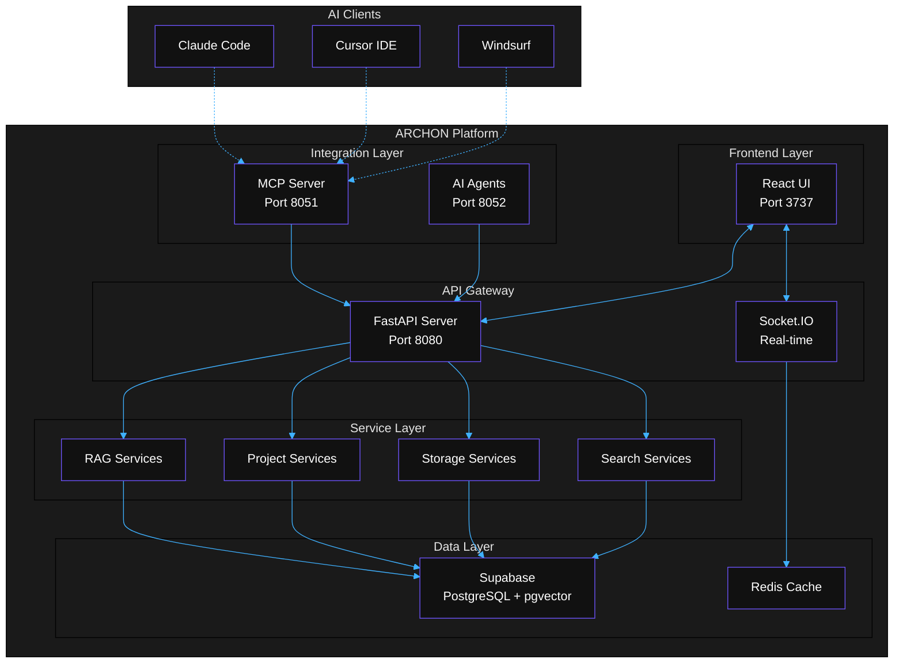
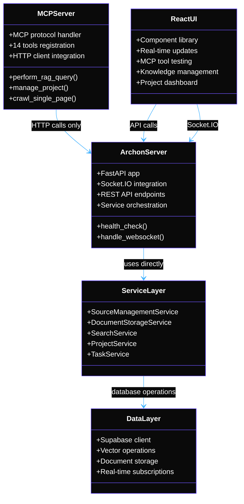
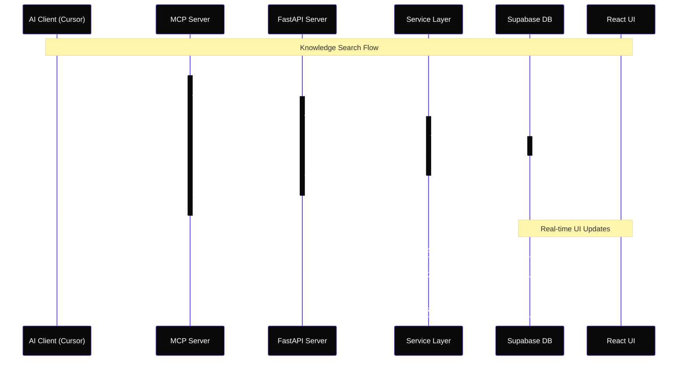
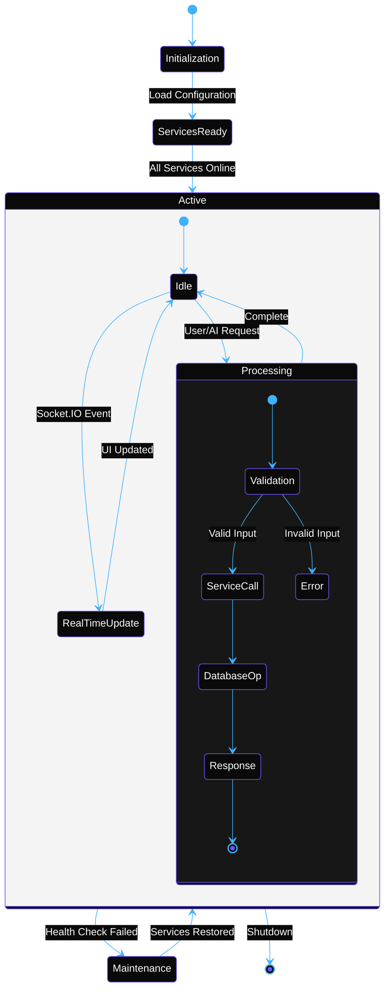

# ARCHON RELOADED
> **Next-Generation AI Development Platform with Model Context Protocol Integration**

[](https://github.com/JackSmack1971/ARCHONRELOADED)
[](LICENSE)
[](https://python.org)
[](https://typescriptlang.org)
[](https://reactjs.org)
[](https://fastapi.tiangolo.com)
[](https://docker.com)


---

## 🚀 Quick Start

```bash
# Clone the repository
git clone https://github.com/JackSmack1971/ARCHONRELOADED.git
cd ARCHONRELOADED

# Configure environment
cp .env.example .env
# Edit .env with your Supabase credentials and API keys

# Start all services
docker-compose up -d

# Access the platform
open http://localhost:3737
```

**🎯 Ready in 3 minutes** - ARCHON provides a complete AI development environment with knowledge management, real-time collaboration, and MCP integration for AI coding assistants.

---

## 📋 Overview

ARCHON RELOADED is a **microservices-based AI development platform** that revolutionizes how AI coding assistants access and utilize project knowledge. Through the Model Context Protocol (MCP), it provides seamless integration with popular AI IDEs like Claude Code, Cursor, and Windsurf.

### 🎯 Key Features

- **🤖 MCP Integration** - Native support for AI coding assistants with 14 specialized tools
- **📚 Intelligent Knowledge Management** - RAG-powered search with vector embeddings
- **⚡ Real-time Collaboration** - Socket.IO-powered live updates and progress tracking  
- **🏗️ Project Management** - Task management with AI agent collaboration
- **🔍 Smart Code Analysis** - Automated code extraction and contextual understanding
- **🌐 Web Crawling** - Intelligent document ingestion from URLs and files
- **🔧 Extensible Architecture** - Plugin-based system for custom integrations

### 🛠️ Technology Stack

| Layer | Technology | Purpose |
|-------|------------|---------|
| **Frontend** | React 18.3 + TypeScript + Vite | Modern, responsive web interface |
| **Backend API** | FastAPI + Socket.IO | RESTful API with real-time features |
| **MCP Server** | Python MCP SDK | Model Context Protocol integration |
| **AI Agents** | PydanticAI | Intelligent agent orchestration |
| **Database** | Supabase (PostgreSQL + pgvector) | Vector search and data persistence |
| **Deployment** | Docker Compose | Containerized microservices |

---

## 🏗️ Architecture Overview

ARCHON follows a clean microservices architecture with clear separation of concerns and scalable design patterns.



### 🎯 Core Design Principles

1. **HTTP-Only MCP Integration** - MCP service makes HTTP calls to Server API, no direct business logic
2. **Service Layer Architecture** - All business logic centralized in reusable service classes
3. **Real-time First** - Socket.IO integration for live updates and collaboration
4. **Type-Safe Development** - Full TypeScript support with Pydantic models
5. **Container-Native** - Built for cloud deployment with Docker and Kubernetes

---

## 📊 System Architecture Deep Dive

### Component Relationships



### Data Flow Architecture



### State Management Flow



---

## 📂 Project Structure

<details>
<summary><strong>📁 Complete Directory Structure</strong></summary>

```
ARCHONRELOADED/
├── 📄 README.md                    # This file
├── 📄 AGENTS.md                    # AI collaboration guide
├── 📄 LICENSE                     # ACL v1.2 license
├── 📄 .env.example                # Environment template
├── 📄 docker-compose.yml          # Main services orchestration
├── 📄 docker-compose.docs.yml     # Documentation service
│
├── 🐍 python/                     # Backend services
│   ├── 📄 pyproject.toml          # Python dependencies
│   ├── 📄 uv.lock                 # Dependency lock file
│   ├── 🐳 Dockerfile.server       # Server service container
│   ├── 🐳 Dockerfile.mcp          # MCP service container
│   ├── 🐳 Dockerfile.agents       # Agents service container
│   └── 📁 src/                    # Source code
│       ├── 🔧 server/             # FastAPI application
│       │   ├── 📄 main.py         # Server entry point
│       │   ├── 📁 api_routes/     # REST API endpoints
│       │   ├── 📁 services/       # Business logic layer
│       │   │   ├── 📁 knowledge/  # Knowledge management
│       │   │   ├── 📁 projects/   # Project services
│       │   │   ├── 📁 rag/        # RAG pipeline
│       │   │   └── 📁 storage/    # Data storage
│       │   └── 📁 models/         # Data models
│       ├── 🔗 mcp/                # MCP integration
│       │   ├── 📄 mcp_server.py   # MCP protocol server
│       │   └── 📁 modules/        # MCP tools
│       └── 🤖 agents/             # PydanticAI agents
│           └── 📄 main.py         # Agents service
│
├── ⚛️ archon-ui-main/             # React frontend
│   ├── 📄 package.json           # Node.js dependencies
│   ├── 📄 vite.config.ts         # Vite configuration
│   ├── 📄 vitest.config.ts       # Testing configuration
│   ├── 🐳 Dockerfile             # Frontend container
│   ├── 📁 src/                   # Source code
│   │   ├── 📁 components/        # React components
│   │   │   ├── 📁 animations/    # Animation components
│   │   │   ├── 📁 knowledge-base/ # Knowledge UI
│   │   │   ├── 📁 layouts/       # Layout components
│   │   │   ├── 📁 mcp/           # MCP client UI
│   │   │   ├── 📁 project-tasks/ # Project management
│   │   │   ├── 📁 settings/      # Settings UI
│   │   │   └── 📁 ui/            # Base UI components
│   │   ├── 📁 pages/             # Page components
│   │   ├── 📁 services/          # API communication
│   │   ├── 📁 contexts/          # React contexts
│   │   ├── 📁 hooks/             # Custom hooks
│   │   └── 📁 types/             # TypeScript types
│   └── 📁 test/                  # Test suites
│       ├── 📁 components/        # Component tests
│       ├── 📁 services/          # Service tests
│       └── 📁 integration/       # Integration tests
│
├── 📚 docs/                       # Documentation
│   ├── 📄 Dockerfile             # Docs container
│   └── 📁 docs/                  # Docusaurus content
│       ├── 📄 architecture.mdx   # System architecture
│       ├── 📄 api-reference.mdx  # API documentation
│       ├── 📄 testing.mdx        # Testing guide
│       └── 📄 deployment.mdx     # Deployment guide
│
├── 🔧 migration/                  # Database setup
│   └── 📄 supabase_schema.sql    # Database schema
│
└── 🔄 run/                       # Deployment scripts
    └── 📄 install.sh             # Installation script
```

</details>

### 🎯 Key Directories Explained

| Directory | Purpose | Key Technologies |
|-----------|---------|------------------|
| **`python/src/server/`** | Core FastAPI application with REST API endpoints and Socket.IO | FastAPI, Socket.IO, Pydantic |
| **`python/src/mcp/`** | Model Context Protocol server with 14 specialized tools | MCP SDK, HTTP client |
| **`python/src/agents/`** | PydanticAI agent orchestration service | PydanticAI, async operations |
| **`archon-ui-main/src/`** | React frontend with TypeScript and modern UI patterns | React 18, TypeScript, Vite |
| **`docs/`** | Comprehensive documentation with Docusaurus | MDX, technical guides |

---

## 🛠️ Installation Guide

### Prerequisites

Ensure your system meets these requirements:

| Requirement | Version | Purpose |
|-------------|---------|---------|
| **Docker** | 20.10+ | Container orchestration |
| **Docker Compose** | 2.0+ | Service management |
| **Node.js** | 20.x+ | Frontend development (optional) |
| **Python** | 3.12+ | Backend development (optional) |

### 🚀 Quick Installation

```bash
# 1. Clone the repository
git clone https://github.com/JackSmack1971/ARCHONRELOADED.git
cd ARCHONRELOADED

# 2. Configure environment
cp .env.example .env
# Edit .env with your credentials (see below)

# 3. Start all services
docker-compose up -d

# 4. Verify installation
docker-compose ps
# All services should show as "healthy"

# 5. Access the platform
open http://localhost:3737
```

### 🔑 Environment Configuration

Create your `.env` file with these essential variables:

```bash
# Database Configuration (Required)
SUPABASE_URL=your_supabase_project_url
SUPABASE_SERVICE_KEY=your_supabase_service_key
SUPABASE_ANON_KEY=your_supabase_anon_key

# AI Services (Required for AI features)
OPENAI_API_KEY=your_openai_api_key
ANTHROPIC_API_KEY=your_anthropic_api_key

# Service Ports (Optional - defaults shown)
ARCHON_UI_PORT=3737
ARCHON_SERVER_PORT=8080
ARCHON_MCP_PORT=8051
ARCHON_AGENTS_PORT=8052
ARCHON_DOCS_PORT=3838

# Logging and Monitoring (Optional)
LOG_LEVEL=INFO
LOGFIRE_ENABLED=false
LOGFIRE_TOKEN=your_logfire_token

# Security (Optional)
MCP_SERVICE_KEY=your_secret_service_key
```

### 🔧 Verification Steps

1. **Check service status:**
   ```bash
   curl http://localhost:8080/health    # Server API
   curl http://localhost:8051/sse       # MCP Server
   curl http://localhost:8052/health    # Agents Service
   ```

2. **Access web interfaces:**
   - **Main UI**: http://localhost:3737
   - **API Documentation**: http://localhost:8080/docs
   - **Project Documentation**: http://localhost:3838

3. **Test MCP integration:**
   ```bash
   # List available MCP tools
   echo '{"method": "tools/list"}' | \
     curl -X POST http://localhost:8051/tools/list
   ```

### 🚨 Common Installation Issues

<details>
<summary><strong>Port conflicts</strong></summary>

**Problem**: Ports already in use

**Solution**: Modify ports in `.env` file:
```bash
ARCHON_UI_PORT=3739
ARCHON_SERVER_PORT=8081
```

</details>

<details>
<summary><strong>Docker permission errors</strong></summary>

**Problem**: Permission denied accessing Docker

**Solution**: Add user to Docker group:
```bash
sudo usermod -aG docker $USER
newgrp docker
```

</details>

<details>
<summary><strong>Database connection errors</strong></summary>

**Problem**: Can't connect to Supabase

**Solution**: Verify credentials and network access:
```bash
# Test connection
curl -H "apikey: $SUPABASE_ANON_KEY" \
  "$SUPABASE_URL/rest/v1/"
```

</details>

---

## 🎮 Usage Instructions

### 🤖 AI Assistant Integration

ARCHON integrates seamlessly with popular AI coding assistants through the Model Context Protocol (MCP).

#### Claude Code Setup

```json
{
  "mcpServers": {
    "archon": {
      "command": "npx",
      "args": ["-y", "@modelcontextprotocol/server-everything"],
      "env": {
        "MCP_SERVER_URL": "http://localhost:8051"
      }
    }
  }
}
```

#### Cursor IDE Setup

1. Open Cursor IDE settings
2. Navigate to Extensions → Model Context Protocol
3. Add server: `http://localhost:8051/sse`
4. Test connection with available tools

#### Available MCP Tools

| Tool Category | Tools | Description |
|---------------|-------|-------------|
| **RAG Tools** | `perform_rag_query`, `search_code_examples` | Semantic search and code discovery |
| **Knowledge** | `crawl_single_page`, `smart_crawl_url`, `get_available_sources` | Content ingestion and management |
| **Projects** | `manage_project`, `manage_task`, `manage_document` | Project lifecycle management |
| **System** | `health_check`, `session_info` | Platform monitoring |

### 📚 Knowledge Management

#### Adding Content Sources

```bash
# Via API
curl -X POST http://localhost:8080/api/knowledge-items/crawl \
  -H "Content-Type: application/json" \
  -d '{
    "url": "https://docs.python.org/3/tutorial/",
    "crawl_type": "smart",
    "max_depth": 2
  }'

# Via UI
# Navigate to Knowledge Base → Add Source → Enter URL
```

#### Querying Knowledge

```python
# Using MCP in your AI assistant
query = "How to implement async functions in Python?"
results = await mcp_client.perform_rag_query(
    query=query,
    match_count=5,
    include_code_examples=True
)
```

### 🏗️ Project Management

#### Creating Projects

```bash
# Via API
curl -X POST http://localhost:8080/api/projects \
  -H "Content-Type: application/json" \
  -d '{
    "title": "My AI Project",
    "description": "Building an AI-powered application",
    "github_repo": "https://github.com/user/repo"
  }'
```

#### Task Management

- **Board View**: Drag-and-drop Kanban interface
- **Table View**: Sortable data grid with bulk actions  
- **Real-time Updates**: Live collaboration with Socket.IO
- **AI Integration**: Task creation and updates via MCP tools

### ⚙️ Configuration Options

#### API Keys Management

Navigate to **Settings → API Keys** to configure:

- **OpenAI**: GPT models and embeddings
- **Anthropic**: Claude models
- **Custom providers**: Additional AI services

#### RAG Configuration

Customize retrieval settings in **Settings → RAG**:

- **Embedding model**: Choose embedding provider
- **Search parameters**: Match count, similarity threshold
- **Reranking**: Enable/disable result reranking
- **Cache settings**: Vector cache configuration

---

## 🧪 Development Guide

### 🏃 Development Environment Setup

```bash
# 1. Clone and enter directory
git clone https://github.com/JackSmack1971/ARCHONRELOADED.git
cd ARCHONRELOADED

# 2. Backend development setup
cd python
python -m venv venv
source venv/bin/activate  # or `venv\Scripts\activate` on Windows
pip install -e .

# 3. Frontend development setup  
cd ../archon-ui-main
npm install

# 4. Start development services
# Terminal 1: Backend
cd python && uvicorn src.server.main:socket_app --reload --port 8080

# Terminal 2: MCP Server
cd python && python -m src.mcp.mcp_server

# Terminal 3: Frontend
cd archon-ui-main && npm run dev

# Terminal 4: Documentation
cd docs && npm start
```

### 🧪 Testing Procedures

#### Backend Testing

```bash
cd python

# Run all tests
uv run pytest src/ -v

# Run specific test categories
uv run pytest src/tests/services/ -v      # Service tests
uv run pytest src/tests/api/ -v           # API tests
uv run pytest src/tests/mcp/ -v           # MCP tests

# Run with coverage
uv run pytest src/ --cov=src --cov-report=html
```

#### Frontend Testing

```bash
cd archon-ui-main

# Run all tests
npm test

# Run specific test suites
npm run test:components      # Component tests
npm run test:services        # Service tests
npm run test:integration     # Integration tests

# Run with coverage
npm run test:coverage
```

#### Integration Testing

```bash
# Full system testing
docker-compose -f docker-compose.yml -f docker-compose.test.yml up --abort-on-container-exit

# MCP tool testing
python scripts/test_mcp_tools.py

# API endpoint testing
python scripts/test_api_endpoints.py
```

### 🏗️ Code Architecture Patterns

#### Service Layer Pattern

```python
# Service classes handle all business logic
class SourceManagementService:
    def __init__(self, supabase_client=None):
        self.supabase_client = supabase_client or get_supabase_client()
        self.logger = logging.getLogger(__name__)

    async def delete_source(self, source_id: str) -> Tuple[bool, Dict]:
        """Delete a knowledge source and cleanup related data."""
        try:
            # Business logic implementation
            result = self.supabase_client.table('sources').delete().eq('id', source_id).execute()
            self.logger.info(f"Deleted source: {source_id}")
            return True, {"message": "Source deleted successfully"}
        except Exception as e:
            self.logger.error(f"Failed to delete source: {e}")
            return False, {"error": str(e)}
```

#### MCP Tool Pattern

```python
# MCP tools make HTTP calls to Server API
@mcp.tool()
async def delete_source(ctx: Context, source: str) -> str:
    """Delete a knowledge source via HTTP call to Server API"""
    client = get_mcp_service_client()
    async with httpx.AsyncClient() as http:
        response = await http.delete(
            f"{client.api_url}/api/sources/{source}",
            headers=client._get_headers()
        )
        return json.dumps(response.json())
```

#### React Component Pattern

```typescript
// Components use hooks for state and real-time updates
const KnowledgeTable: React.FC<KnowledgeTableProps> = ({ sources, onDelete, onRefresh, loading }) => {
  const { showToast } = useToast();
  const ws = useWebSocket();

  useEffect(() => {
    // Subscribe to real-time updates
    ws.on('knowledge_updated', (data) => {
      // Handle real-time updates
      onRefresh?.(data.id);
    });

    return () => ws.off('knowledge_updated');
  }, [ws, onRefresh]);

  // Optimized with React.memo for performance
  return <MemoizedTableComponent {...props} />;
};
```

### 🎯 Contribution Guidelines

#### Pull Request Process

1. **Fork and Branch**
   ```bash
   git checkout -b feature/your-feature-name
   ```

2. **Development Standards**
   - Follow existing code patterns
   - Add tests for new functionality
   - Update documentation as needed
   - Ensure all tests pass

3. **Commit Standards**
   ```bash
   # Use conventional commits
   git commit -m "feat: add smart crawling with depth limits"
   git commit -m "fix: resolve MCP connection timeout issues"
   git commit -m "docs: update API reference with new endpoints"
   ```

4. **Testing Requirements**
   ```bash
   # All tests must pass
   npm test && cd python && uv run pytest
   
   # Code quality checks
   npm run lint && cd python && uv run ruff check src/
   ```

#### Code Style Conventions

- **Python**: Follow PEP 8, use `ruff` for linting and formatting
- **TypeScript**: Use ESLint + Prettier configuration
- **Naming**: snake_case for Python, camelCase for TypeScript
- **Documentation**: Comprehensive docstrings and inline comments

---

## 🚀 Deployment Guide

### 🐳 Production Docker Deployment

```bash
# 1. Create production environment file
cp .env.example .env.prod
# Configure production values

# 2. Build optimized images
docker-compose -f docker-compose.yml -f docker-compose.prod.yml build

# 3. Deploy with resource limits
docker-compose -f docker-compose.yml -f docker-compose.prod.yml up -d

# 4. Verify deployment
curl https://your-domain.com/health
```

### ☸️ Kubernetes Deployment

```yaml
# Basic Kubernetes manifests included
kubectl apply -f k8s/namespace.yaml
kubectl apply -f k8s/configmap.yaml
kubectl apply -f k8s/secrets.yaml
kubectl apply -f k8s/deployments.yaml
kubectl apply -f k8s/services.yaml
kubectl apply -f k8s/ingress.yaml
```

### 🔍 Monitoring and Health Checks

#### Service Health Endpoints

| Service | Health Check | Purpose |
|---------|--------------|---------|
| **Server** | `GET /health` | FastAPI and database connectivity |
| **MCP** | `GET /sse` | MCP server and tool availability |
| **Agents** | `GET /health` | PydanticAI agent status |
| **UI** | `GET /` | Frontend service availability |

#### Monitoring with Logfire (Optional)

```bash
# Enable enhanced monitoring
export LOGFIRE_ENABLED=true
export LOGFIRE_TOKEN=your_logfire_token

# View logs and metrics at https://logfire.pydantic.dev/
```

### 📈 Scaling Considerations

```yaml
# Scale individual services based on load
services:
  archon-server:
    deploy:
      replicas: 3
      resources:
        limits:
          cpus: '2'
          memory: 4G

  archon-agents:
    deploy:
      replicas: 5  # Scale for AI processing
```

---

## 🔗 API Reference

### 🌐 Core API Endpoints

<details>
<summary><strong>📚 Knowledge Management</strong></summary>

#### Knowledge Sources

```http
GET    /api/sources                    # List all knowledge sources
POST   /api/knowledge-items/crawl      # Crawl URL for content
DELETE /api/sources/{source_id}        # Delete knowledge source
GET    /api/knowledge-items            # Get knowledge items with pagination
POST   /api/documents/upload           # Upload document files
```

#### RAG Operations

```http
POST   /api/rag/query                  # Perform semantic search
POST   /api/rag/code-search            # Search code examples
GET    /api/rag/sources                # Get available RAG sources
```

</details>

<details>
<summary><strong>🏗️ Project Management</strong></summary>

#### Projects

```http
GET    /api/projects                   # List projects
POST   /api/projects                   # Create new project
GET    /api/projects/{project_id}      # Get project details
PUT    /api/projects/{project_id}      # Update project
DELETE /api/projects/{project_id}      # Delete project
```

#### Tasks

```http
GET    /api/projects/{project_id}/tasks        # List project tasks
POST   /api/projects/{project_id}/tasks        # Create task
PUT    /api/tasks/{task_id}                    # Update task
DELETE /api/tasks/{task_id}                    # Delete task
```

#### Documents

```http
GET    /api/projects/{project_id}/documents    # List project documents
POST   /api/projects/{project_id}/documents    # Create document
PUT    /api/documents/{document_id}            # Update document
```

</details>

### 🔌 MCP Tool Integration

#### Available Tools

```python
# RAG Tools
await mcp_client.perform_rag_query(query="Python async patterns", match_count=5)
await mcp_client.search_code_examples(language="python", pattern="async def")
await mcp_client.crawl_single_page(url="https://docs.python.org/3/")

# Project Tools  
await mcp_client.manage_project(action="create", title="New Project")
await mcp_client.manage_task(action="create", project_id="123", title="Implement feature")
await mcp_client.manage_document(action="add", project_id="123", title="API Docs")

# System Tools
await mcp_client.health_check()
await mcp_client.session_info()
```

### 📡 Real-time WebSocket Events

```typescript
// Socket.IO event types
interface SocketEvents {
  // Knowledge events
  knowledge_updated: (data: { id: string, action: string }) => void;
  crawl_progress: (data: { progress: number, url: string }) => void;
  
  // Project events
  project_updated: (data: Project) => void;
  task_updated: (data: Task) => void;
  
  // System events
  health_status: (data: { service: string, status: string }) => void;
}
```

---

## 🤝 Contributing

ARCHON RELOADED is designed to be hackable and extensible. We welcome contributions from developers, AI researchers, and productivity enthusiasts.

### 🎯 Contribution Areas

| Area | Technologies | Good For |
|------|-------------|----------|
| **Backend Services** | Python, FastAPI, PydanticAI | API endpoints, AI agents, MCP tools |
| **Frontend Features** | React, TypeScript, Socket.IO | UI components, real-time features |
| **AI Integrations** | MCP, RAG, Vector search | AI tool integrations, search improvements |
| **Documentation** | MDX, technical writing | Guides, tutorials, API docs |
| **DevOps** | Docker, Kubernetes, CI/CD | Infrastructure, monitoring, automation |

### 🚀 Getting Started with Contributions

```bash
# 1. Fork the repository
git fork https://github.com/JackSmack1971/ARCHONRELOADED.git

# 2. Set up development environment
cd ARCHONRELOADED
cp .env.example .env
docker-compose up -d

# 3. Create feature branch
git checkout -b feature/your-amazing-feature

# 4. Make your changes and test
npm test && cd python && uv run pytest

# 5. Submit pull request
git push origin feature/your-amazing-feature
```

### 📋 Contribution Checklist

- [ ] Tests pass locally (`npm test` and `uv run pytest`)
- [ ] Code follows project style guidelines
- [ ] Documentation updated for new features
- [ ] No breaking changes without discussion
- [ ] Performance impact considered
- [ ] Security implications reviewed

---

## 🔍 Troubleshooting

### 🚨 Common Issues

<details>
<summary><strong>🐳 Container Issues</strong></summary>

**Services fail to start:**
```bash
# Check Docker status
docker-compose ps
docker-compose logs archon-server

# Rebuild containers
docker-compose down
docker-compose up --build -d
```

**Port conflicts:**
```bash
# Modify ports in .env
ARCHON_UI_PORT=3739
ARCHON_SERVER_PORT=8081
```

</details>

<details>
<summary><strong>🔌 MCP Connection Issues</strong></summary>

**AI clients can't connect:**
```bash
# Test MCP server
curl http://localhost:8051/sse

# Check MCP logs
docker-compose logs archon-mcp

# Verify tool availability
echo '{"method": "tools/list"}' | curl -X POST http://localhost:8051/tools/list
```

</details>

<details>
<summary><strong>🔍 Search Issues</strong></summary>

**Empty search results:**
```bash
# Check available sources
curl http://localhost:8080/api/sources

# Test basic query
curl -X POST http://localhost:8080/api/rag/query \
  -H "Content-Type: application/json" \
  -d '{"query": "test", "match_count": 1}'
```

</details>

<details>
<summary><strong>⚡ Performance Issues</strong></summary>

**Slow responses:**
- Check database connection and indexes
- Monitor container resource usage: `docker stats`
- Review logs for bottlenecks: `docker-compose logs`
- Consider scaling services: `docker-compose up -d --scale archon-agents=3`

</details>

---

## 📄 License

**Archon Community License (ACL) v1.2** - See [LICENSE](LICENSE) file for complete terms.

### License Summary

✅ **Permitted:**
- Use ARCHON for any purpose (personal, commercial, enterprise)
- Modify and distribute the source code
- Create derivative works and forks
- Commercial usage in your projects

❌ **Not Permitted (without permission):**
- Selling ARCHON as a standalone product
- Offering hosted ARCHON instances as a service
- Redistributing as part of paid software bundles

💡 **Consulting Welcome:**
- Get paid to install, customize, or train users
- Commercial support and development services
- Custom integrations and extensions

---

## 🙏 Acknowledgments

ARCHON RELOADED is built on the shoulders of giants. Special thanks to:

- **[Model Context Protocol](https://github.com/modelcontextprotocol)** - Revolutionizing AI tool integration
- **[FastAPI](https://fastapi.tiangolo.com/)** - Modern Python web framework
- **[React](https://react.dev/)** - Component-based UI development
- **[Supabase](https://supabase.com/)** - Open-source backend platform
- **[PydanticAI](https://ai.pydantic.dev/)** - Type-safe AI agent framework
- **[pgvector](https://github.com/pgvector/pgvector)** - Vector similarity search

### 🌟 Community Contributors

- **Early Adopters** - Providing feedback and bug reports
- **Open Source Community** - Inspiration and best practices
- **AI Development Community** - Advancing the field of AI-assisted development

---

## 🔗 Additional Resources

### 📚 Documentation

- **[Architecture Deep Dive](docs/docs/architecture.mdx)** - System design and patterns
- **[API Reference](docs/docs/api-reference.mdx)** - Complete endpoint documentation  
- **[Testing Guide](docs/docs/testing.mdx)** - Development and testing procedures
- **[Deployment Guide](docs/docs/deployment.mdx)** - Production deployment strategies

### 🌐 External Resources

- **[MCP Official Documentation](https://github.com/modelcontextprotocol/python-sdk)** - Model Context Protocol SDK
- **[FastAPI Documentation](https://fastapi.tiangolo.com/)** - API framework reference
- **[React Documentation](https://react.dev/)** - Frontend framework guide
- **[Supabase Documentation](https://supabase.com/docs)** - Database and backend services

### 💬 Community & Support

- **[GitHub Issues](https://github.com/JackSmack1971/ARCHONRELOADED/issues)** - Bug reports and feature requests
- **[GitHub Discussions](https://github.com/JackSmack1971/ARCHONRELOADED/discussions)** - Community discussions and Q&A
- **[Documentation Site](http://localhost:3838)** - Local comprehensive documentation

---

<div align="center">
  
**🚀 Ready to revolutionize your AI development workflow?**

[Get Started](#-quick-start) • [Documentation](docs/) • [Contribute](#-contributing) • [Community](https://github.com/JackSmack1971/ARCHONRELOADED/discussions)

---

*Built with ❤️ for the AI development community*

*Last updated: Sunday, August 17, 2025*

</div>
